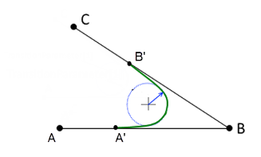

# Features of `TMStartVelocity`

The calculation of the blending points is based on an idealized velocity curve, which can deviate from the actual velocity curve. At this time, a deceleration ramp is simulated on the original path towards the blending point and an acceleration ramp and away from the blending point. The minimum from both the programmed path velocity and the estimated maximum path velocity resulting from the axis limits is used as the target velocity.

In addition, when blending between straight lines, the angle between them is taken into account. A minimum curvature radius for the blending element results from the desired path velocity and the estimated dynamics limits. The points A' and B' result in turn from this radius and the angle between the straight lines.

If the movements are slowed down during the blending process despite a set factor of 1, then increasing the factor may help.

15.0

© Copyright 2026, CODESYS GmbH