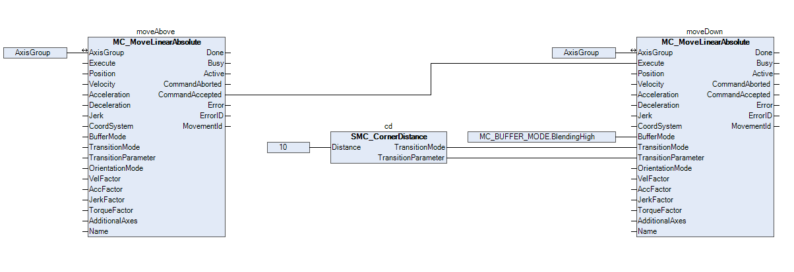

# Example

In a small example application, a workpiece is supposed to be picked up. The robot should first move above the workpiece and then downwards to pick it up. To reach the workpiece as fast as possible, travel between the two movements should not be stopped, but blended. Blending into the second movement should begin ten units before the end of the first movement is reached.

In order to meet the requirements, two movements must be commanded. The first movement (`moveAbove`) over the workpiece and the second movement (`moveDown`) downwards towards the workpiece. For the second movement, it must be defined how the movement should be buffered and blended.

As shown in the following image, `BlendingHigh` is selected for the `BufferMode`. This defines that the movement should be buffered after the first movement and then blended. In addition, for the `TransitionMode`, `TMCornerDistance` is defined with a distance of 10 units to smoothly blend the first movement into the second movement. In order to set the two inputs `TransitionMode` and `TransitionParameter` appropriately, the `SMC_CornerDistance` function block is used.

15.0

© Copyright 2026, CODESYS GmbH