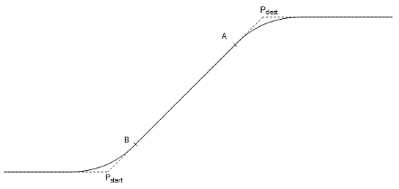

# Stopping a movement by pausing

You can use the `MC_GroupInterrupt` and `MC_GroupInterruptAt` function blocks to interrupt the execution of the commanded movements. For `MC_GroupInterrupt`, an immediate stop is executed. For `MC_GroupInterruptAt`, a stop is executed at a specific position. Then the movement can be resumed later with `MC_GroupContinue`.

The function block `MC_GroupInterruptAt` provides the input `SMC_GroupInterruptPositionMvtRel`. This specifies an interrupt position relative to a movement. The movement is referenced by its `SMC_Movement_Id`. The position within the movement is defined by a value (real) between 0 and 1, where 0 is the beginning of the movement and 1 is the end. A position between the points B and A is interpreted exactly as if there were no blending. A position between Pstart and B or between A and Pdest is projected on the blending path.

**Error handling for MC\_GroupInterruptAt**

* When the specified movement ID is unknown, the function block returns an error. The running movement is not interrupted.
* If the current dynamic state of the axis group does not allow reaching the standstill before the specified interrupt position, then `SMC_GroupInterruptAt` behaves exactly like `MC_GroupInterrupt`: the interruption is executed immediately and the axis group reaches the standstill somewhere behind the commanded interrupt position.
* All other errors are handled exactly like for `MC_GroupInterrupt`.

**Limitations of MC\_GroupInterruptAt**

* An interrupt at a specific position can be aborted with another movement as long as the process of stopping at the interrupt position has not started yet.
* Only one interrupt can be commanded at a specific position at the same time. If an interrupt has been commanded, then it has to be either completed or aborted so that another interrupt can be accepted.

When you execute `MC_GroupInterrupt` or `MC_GroupInterruptAt`, a path-invariant stop is executed at first, similar to an `MC_GroupHalt`. Then the state of the axis group ("continue data") is stored in a variable transferred by the user (type `SMC_AXIS_GROUP_CONTINUE_DATA`). Now the axis group is in the state `GroupStandby` and can be used normally. A typical example would be that the axis group is jogged.

Later, you can use `MC_GroupContinue` to continue the interrupted execution. To do this, transfer the saved "continue data". For this to work without errors, the position of the axis group has to match the position it had after execution of `MC_GroupInterrupt`. (See `SMC_GroupGetContinuePosition`.)

When a tracking movement has been interrupted (meaning a movement that was commanded relative to a dynamic coordinate system), `MC_GroupInterrupt` does not stop absolutely (like `MC_GroupHalt`), but relatively to the dynamic coordinate system. For example, if a workpiece is tracked on a rotary table, `MC_GroupInterrupt` halts with respect to the workpiece. The axis group continues to follow the workpiece. The continue data has to get updated with `SMC_GroupUpdateContinueData` if the kinematic has rotary axes with multiple periods. Afterwards, the movement can be continued with `MC_GroupContinue`.

IMPORTANT:

The variable of type `SMC_AXIS_GROUP_CONTINUE_DATA` must not be stored persistently or changed during an online change.

TIP:

Using the function block `SMC_GroupWait`, you can wait on the path between two movements for a programmable time.

15.0

© Copyright 2026, CODESYS GmbH