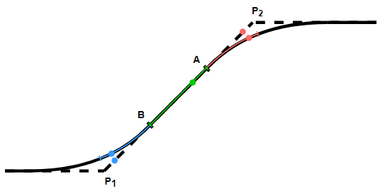

# Triggers for movements with blending

For movements with [Buffering and Blending of Movements](_sm_robotics_blending.html#_sm_robotics_blending), the triggers are projected onto the blending path. The following image qualitatively shows a case in which a movement from P1 to P2 as well as a subsequent movement were each commanded with blending. Blending to the first movement ends at point B, and blending to the subsequent movement starts at point A. The blue trigger is located between P1 and B. It gets projected onto the back half of the first blending movement (highlighted by the blue line). In the same way, the red trigger, located between A and P2, is projected onto the front half of the second blending movement (highlighted by the red line). The green trigger is outside of the blending areas and is not shifted.

When blending with triggers, there is a special feature concerning the status of the movement and the respective triggers. The command function block for moving from P1 to P2 reports `Done` as soon as point A is reached. However, the red trigger associated with this movement remains active until the position on the blending element to which it was projected is reached.

15.0

© Copyright 2026, CODESYS GmbH