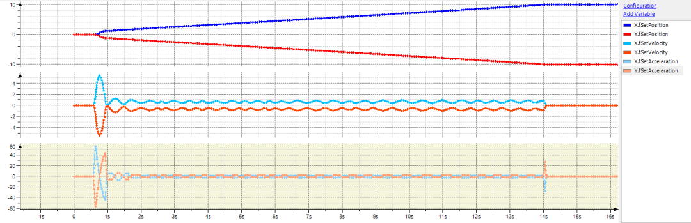

# Case 1: Performance problems of the planning task

If there are problems with the performance during the planning, then the movement might look like this instead:

This is because the movement is planned in the planning task in parallel to execution in the bus task. On average, the planning task needs to provide as much trajectory as the bus task requires. If the performance is not sufficient for this, then the movement is slowed down. This leads to the wavy velocity curve.

The first and most important tool for diagnosing such problems is the trace. In addition to the `fSetPosition`, `fSetVelocity`, and `fSetAcceleration` variables for each axis, the `numTimeBudgetExceeded` and `numSlowDownLowIpoQueue` outputs of the `SMC_GroupReadPlanningStatistics` function block should also be recorded. If these counters increase continuously, then there is a performance problem.

| NOTICE | |
| --- | --- |
|  | Similarly to the `fSetPosition`, `fSetVelocity`, and `fSetAcceleration` variables, there is also the `fSetJerk` variable for the jerk. It should be noted that the jerk is not the average jerk which is applied during the bus task cycle (as often expected), but rather the instantaneous jerk at the end of the cycle. Therefore, `FSetJerk` has only limited significance for diagnosing performance problems. |

15.0

© Copyright 2026, CODESYS GmbH