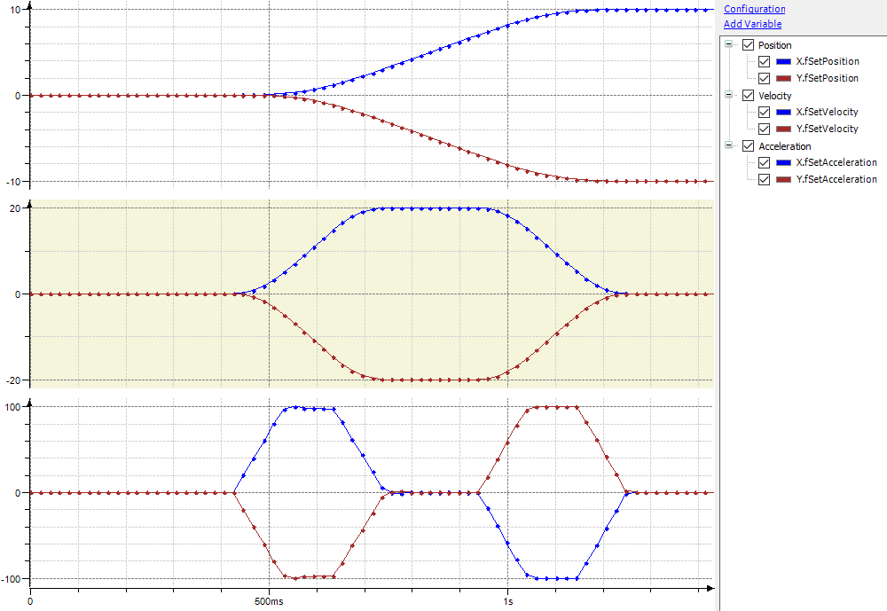

# Diagnosis in case of slow or jerky movements

If there are no performance problems, then each movement is planned in such a way that at least one of the [effective limits](_sm_robotics_factor_movements.html#_sm_robotics_factor_movements) is reached during the entire movement. As an example, consider a simple two-dimensional gantry with two axes X and Y and a PTP movement from position (0,0) to (10,-10). The maximum axis velocity is 20, the maximum axis acceleration is 100, and the maximum axis jerk is 1000.

The expected movement looks like this:

Acceleration is first established with a maximum jerk until the acceleration limit value of 100 is reached. After a short phase of constant acceleration, the acceleration is reduced again with a maximum jerk so that the velocity limit value of 20 is reached with acceleration 0. After a phase of constant velocity, deceleration takes place so that the target position is reached with velocity and acceleration 0.

**There are two possible reasons why the real movement deviates from this ideal curve:**

* The planned movement does not correspond to the ideal curve due to performance problems in the planning task.
* The planned movement corresponds to the ideal curve, but the robot does not execute it as expected.

15.0

© Copyright 2026, CODESYS GmbH