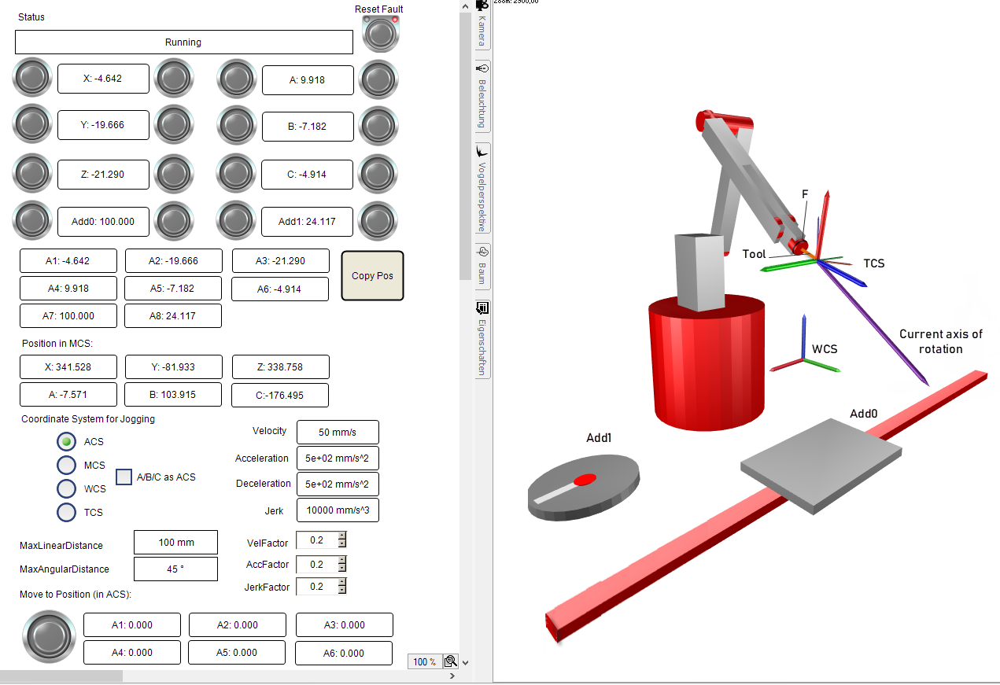

# Application

**In order to demonstrate the most general case possible, the example has the following functions:**

* Use of a robot with singularities (6-axis articulated robot). The example shows that you can move the robot through singularities in ACS and then continue jogging in a Cartesian way in a different configuration.
* Shifting and rotation of the machine coordinate system (MCS) of the robot with respect to the world coordinate system (WCS). In this way, you can see how jogging differs in MCS and WCS.
* Configuration of a tool shifted and rotated with respect to the flange (F). In the figure below, you can see the tool and the shifting and rotation of the TCS with respect to the flange (F).
* An linear additional axis `Add0` and a rotary additional axis `Add1`.

15.0

© Copyright 2026, CODESYS GmbH