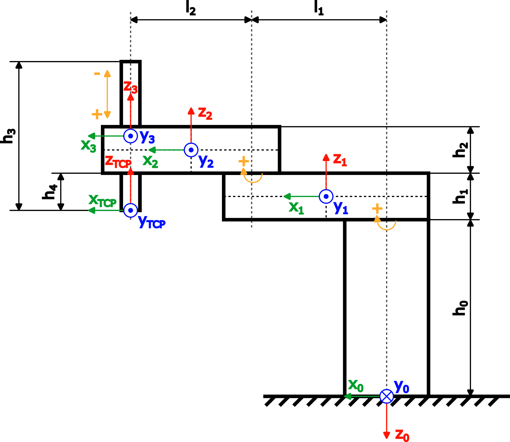

# Structure of the application

**Part 1: Using a dynamic model in an application**

* The code for this part is located in the `TorqueLimitationDemo`folder.
* `PLC_PRG` is the main program, which includes a state machine that triggers test movements.
* The movements can be monitored using the `Trace`.

**Part 2: Creating a dynamic robot model**

* The code for the dynamic model is located in the `DynModel` folder.
* `DynModel_Scara2_Z` is the dynamic model of the SCARA robot.
* `DynModel_Tests` runs all tests of `Test_DynModel_Scara2_Z` to check for common mistakes.
* The dynamic model is based on a SCARA robot with two revolute joints and one prismatic Z-axis. A figure of the robot with the required dimensions and coordinate systems for the dynamic model is shown below:

  

  | Dimension in Figure | Corresponding Variable Name in the Sample Project in the Function Block DynModel\_Scara2\_Z |
  | --- | --- |
  | `h0` | `baseHeight` |
  | `h1` | `armOneHeight` |
  | `h2` | `armTwoHeight` |
  | `h3` | `zAxisLength` |
  | `h4` | `zAxisOffset` |
  | `l1` | `armOneLength` |
  | `l1` | `armTwoLength` |

15.0

© Copyright 2026, CODESYS GmbH