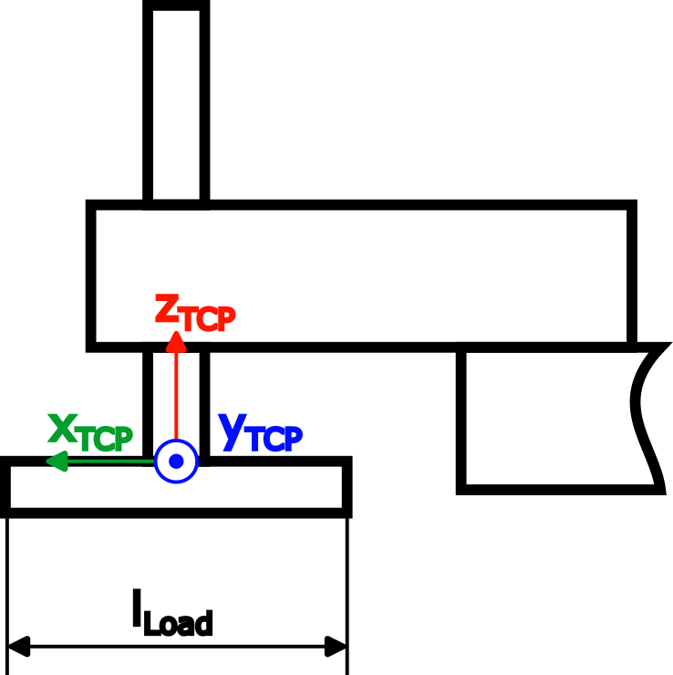
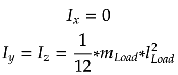
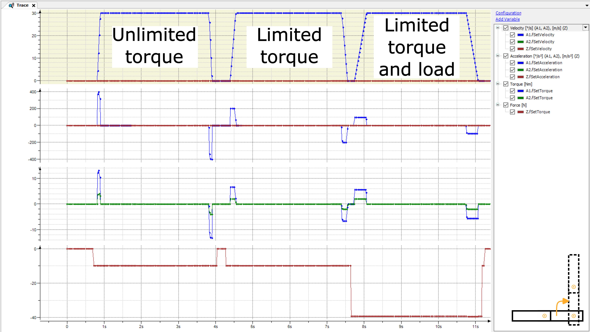
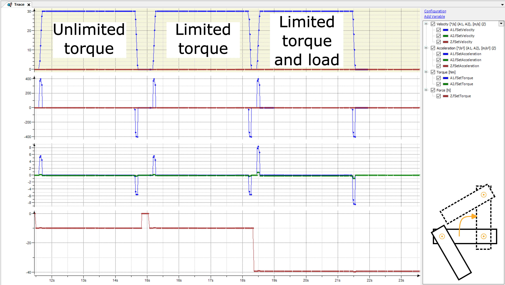

# Part 1: Using a dynamic model in an application

Using a dynamic model in an application requires a model which implements the `ISMDynamics` interface of the `SM3_Dynamics` library. The dynamic model from [Part 2: Creating a dynamic robot model](65e2ffd48d7ec46834ed3e0c1f940c0a.html#UUID-21347f71-cabb-badd-d9a0-0c3a2412973c_section-idm4583105024958433369980945572) is used for this demonstration.

The model can be assigned to an axis group using `SMC_GroupSetDynamics`. This step requires setting up the gravitational acceleration with respect to the MCS. Because the SCARA in this example is mounted on the floor, the gravitational acceleration points in the positive z0 direction. The gravitational acceleration has to be specified in user units u/s². Because all lengths in this example have been defined in the user unit m, also the gravitational acceleration has to be specified in m/s².

`SMC_ChangeDynamicLimits` can be used to adjust the limits of each axis. Note that the axis group has to be enabled again using `MC_GroupEnable` in order to activate the new dynamic limits.

If additional masses are added to the TCP (for example, a tool or an object which is picked up by the robot), then `SMC_GroupSetLoad` can be used to define the load.

The `PLC_PRG` program contains all of the above components and executes two test movements:

| Movement 1 | Movement 2 |
| --- | --- |
| Straight arm movement from (a0=0°, a1=0°, a2=0 m) to (a0=90°, a1=0°, a2=0,02 m): | Angled arm movement from (a0=0°, a1=-120°, a2=0 m) to (a0=90°, a1=-120°, a2=0,02 m): |

**Each movement is executed three consecutive times with the following boundary conditions:**

* The torque limit of all axes is infinite (unlimited).
* The torque limit of Arm 2 is set to a lower value than the maximum reached torque during unlimited movement. The value was arbitrarily set to `2 Nm`.
* The torque limit of Arm 2 is still `2 Nm`, and additionally a load has been applied at the TCP (`mLoad=3 kg`, `lLoad=0.2 m`):

The inertia calculation for the load has been simplified by using thin rods:

The movements can be monitored in the trace. Movement 1 has the following results:

* Even though Arm 2 does not move during Movement 1, the movement of Arm 1 results in a torque for Arm 2 during acceleration/deceleration. The calculated torque is sent to the drive and can potentially improve the controller loop in controller mode `SMC_velocity` or `SMC_position`. This is also called torque feed forward control.
* The second pass with limited torque shows that the torque limit of Arm 2 leads to a slower movement of Arm 1. And that even if Arm 2 does not move. Without the dynamic model, the acceleration and deceleration of Arm 1 would have to be reduced manually for this movement in order to prevent excessive mechanical stress on Arm 2.
* The third run with a load slows down the movement of Arm 1 even more in order to not violate the torque limit of Arm 2.

**The advantages of using a dynamic model are obvious. To prevent excessive mechanical stress without dynamic model:**

* Either the dynamic limits for every movement would have to be set depending on the current state of the robot.
* Or the dynamic limits of all axes would have to be decreased in such a way that all potential movements will not lead to excessive mechanical stress on any axis.

The first method is a complex task and it can be difficult to calculate reasonable limits, while the second method results in movements which are not as fast as possible most of the time. These drawbacks no longer exist with a dynamic model because the robot always moves as fast as possible while still respecting the mechanical limits of each axis.

These advantages are illustrated by the results of Movement 2:

Due to the angled Arm 2, the resulting torque of Arm 2 is considerably lower than with Movement 1. Therefore, all three runs are never limited by the axis torque. If one had used adjusted dynamic limits based on Movement 1 (reduced acceleration and deceleration in order to not violate the torque limit of Arm 2), then this movement would have been slower than necessary.

15.0

© Copyright 2026, CODESYS GmbH