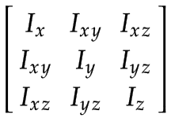
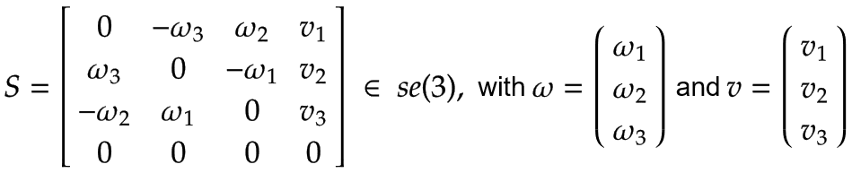
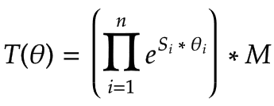

# Part 2: Creating a dynamic robot model

The model which is created in this example is based on an algorithm for open-chain robots as presented in the book "Modern Robotics" by K. M. Lynch and F. C. Park (see Chapter 8 "Dynamics of Open Chains"). The explanation of this algorithm is beyond the scope of this example. Instead, the example focuses on how to define the input values of the algorithm.

**Simplifications**

**To make this example more understandable, some simplifications have been made:**

* The arm lengths `l1` and `l2` (distance between the axes of rotation) are used as their respective total arm length.
* The center of mass is always located in the geometric center of each link.
* The spatial inertia matrices of the arms and the Z-axis are calculated for thin rods.

**Dynamic model requirements**

In order to use the dynamic model in a SoftMotion application, this model has to implement the `ISMDynamics` interface of the `SM3_Dynamics` library.

The zero position, coordinate systems, and the positive direction of rotation of the dynamic model can theoretically deviate from the kinematic model. However, these differences have to be taken into consideration, and to simplify the dynamic model, it is therefore recommended to use the definitions of the kinematic model.

Because the dynamic model must compute torque values in Nm and forces in N, it has to convert the user unit u for lengths to SI units m. The conversion factor can be set by `SMC_GroupSetUnits` and is included in the `addParams` input of `ISMDynamics.AxesStateToTorque`. This example uses only m for lengths and can therefore ignore the conversion factor.

**Specification of the geometric and dynamic data of the model**

**The IEC implementation of the algorithm presented in the book "Modern Robotics" by K. M. Lynch and F. C. Park (see Chapter 8 "Dynamics of Open Chains") requires the following input values:**

* The center of mass position of each link when the robot is in the home position. The position is specified in the coordinate system of the previous link (the first link is specified relative to the base coordinate system).
* The spatial inertia matrix and mass of each link, expressed in the respective link frame.
* The screw axis of each joint, expressed in the base frame.

Center of mass positions

The frames with the center of mass position of each link are as follows:

| Link | Frame |
| --- | --- |
| Arm 1 | The center of mass of Arm 1, expressed in the base coordinate system x0, y0, z0:  Note that there is a rotation of 180° around the x0-axis. |
| Arm 2 | The center of mass of Arm 2, expressed in the coordinate system of Arm 1: |
| Z-axis | The center of mass of the Z-axis expressed in the coordinate system of Arm 2: |
| Tool Center Point (TCP) | One additional frame to handle an arbitrary load at the TCP (for example, by a tool, a product, or a combination of both), expressed in the coordinate system of the Z-axis: |

Spatial inertia matrices

The spatial inertia values have to be expressed in the respective link frame. Since the frames are defined at the center of mass, the spatial inertia can be represented by a 3x3 rotational inertia matrix and the mass of the body.

With the simplification of using thin rods for the joints, the components of the rotational inertia matrix are as follows:

| Link | Components of the rotational inertia matrix |
| --- | --- |
| Arm 1, Arm 2 | Arm 1 and Arm 2 with their corresponding mass `m1` and `m2`, and length `l1` and `l2`: |
| Z-axis |  |

Screw axes

The screw axes of all joints have to be expressed relative to the base coordinate system x0, y0, z0.

| Link | Screw Axis |
| --- | --- |
| Arm 1 | Imagine a turntable which rotates around Joint 1 in the positive direction with an angular velocity of 1 rad/s.  Expressed in the base coordinate system, this is a positive rotation around the z0-axis according to the right-hand rule:  Because the axis of rotation of Arm 1 is equal to the center of the base coordinate system, the linear velocity is zero: |
| Arm 2 | Imagine again a turntable which rotates around Joint 2 in the positive direction with an angular velocity of 1 rad/s. This case is displayed below as a top view of Arm 1:  As for Arm 1, the angular velocity is:  The figure shows the resulting linear velocity v2,y, which points in negative y0 direction and is equal to v2,y=-ω2,z \* l1. |
| Z-axis | **The Z-axis is a prismatic axis for which the following rules apply:**   * The angular velocity vector ω is zero. * The linear velocity vector is a unit vector in the direction of positive translation.   This leads to the following vectors, expressed in the base coordinate system x0, y0, z0: |

**Tests**

The dynamic model can now be tested because all model parameters are defined. This section includes some basic tests of the model.

Checking the screw axes

A screw axis `S` with angular velocity ω and linear velocity `v` can be expressed as an element of `se(3)`:

A forward transformation `T` can be executed with the screw axes `S`, an end effector frame `M` for the zero position of the robot, and the joint angle `θ` of each joint:

The sample project already includes a function which solves this equation (see `SMC_OpenChainKinematics_SolveForward`). For more details, see the book "Modern Robotics" by K. M. Lynch and F. C. Park.

Using the forward transformation equation, one can now run a test with known axis positions and check if the transformation leads to the expected result.

Checking the torque calculation at standstill

To check the center of mass position frames, you can manually calculate the resulting axis torque in standstill for given axis positions and compare them to the computed values by the model. Because this example is based on a SCARA robot mounted on the floor, all axis positions in standstill will lead to the same torques or forces of the drives:

| Joint | Resulting Torque/Force |
| --- | --- |
| Arm 1 | Because Arm 1 is a revolute axis, the result is a torque: `M1=0 Nm`. |
| Arm 2 | Because Arm 2 is a revolute axis, the result is a torque: `M2=0 Nm`. |
| Z-axis | Because the Z-axis is a prismatic axis, the result is a force: `F3=m3*g N` with gravitational acceleration `g`. |

15.0

© Copyright 2026, CODESYS GmbH