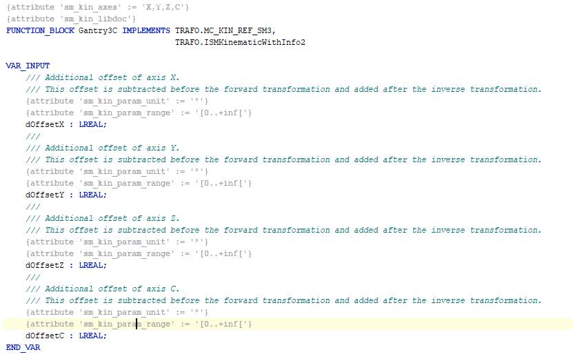

# 3. Create the Gantry3C function block.

This function block implements the interfaces `MC_KIN_REF_SM3` and `ISMKinematicsWithInfo2` from the library `SM3_Transformation`. You can define an offset as input for each axis. This offset is subtracted before the forward transformation and added after the inverse transformation.



Example of `Gantry3C` with two decoupled kinematics and `KinCoupled`:

```
FUNCTION_BLOCK Custom_Kin_Gantry3 IMPLEMENTS ISMPositionKinematics
FUNCTION_BLOCK Custom_Kin_CAxis IMPLEMENTS ISMOrientationKinematics

FUNCTION_BLOCK Custom_Kin_Gantry3C EXTENDS Kin_Coupled
```

Provide the function blocks `Custom_Kin_Gantry3` and `Custom_Kin_CAxis` as inputs for the `Kin_Coupled` function block during initialization. Now `Custom_Kin_Gantry3C` becomes a coupled kinematics combining the position and orientation kinematics.

15.0

© Copyright 2026, CODESYS GmbH