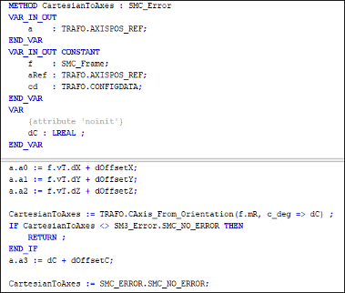
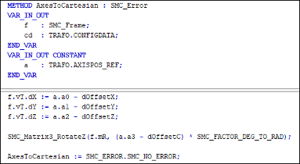
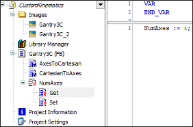

# 4. Implement the methods of the MC\_KIN\_REF\_SM3 interface and the NumAxes4 property.

`AxesToCartesian`: Forward kinematics: Calculation of the position and orientation from the axis values.

`CartesianToAxes`: Inverse kinematics: Calculation of the axis values from position and orientation.

`NumAxes`: Number of axes of the kinematics

15.0

© Copyright 2026, CODESYS GmbH