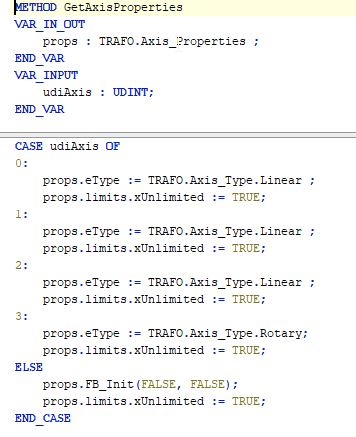
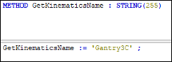

# 5. Implement the methods of the ISMKinematicsWithInfo2 and ISMKinematicsWithInfo interfaces.

`GetAxisProperties`: Properties, such as type of axis. The limits for each axis can be defined.

`GetKinematicsName`: Name of the kinematics

`IsSingularity`: Can be ignored for this kinematics

15.0

© Copyright 2026, CODESYS GmbH