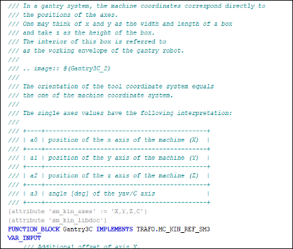
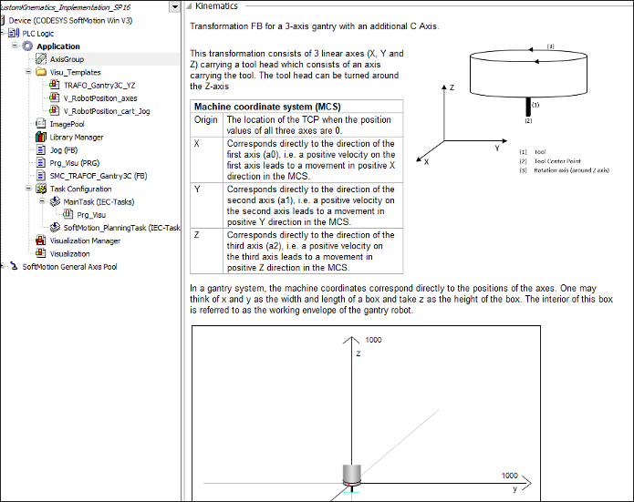
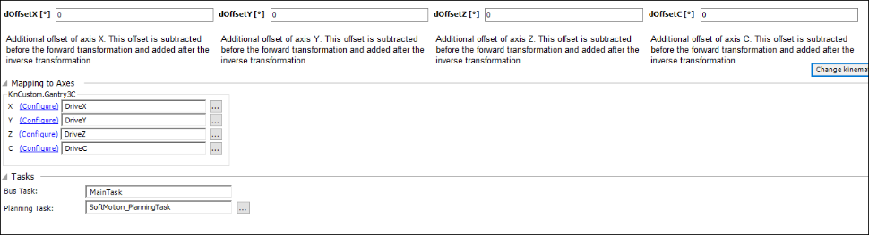

# 8. Create the description in the axis group configurator.

IMPORTANT:

To create the description, you first need to install the CODESYS Library Documentation Support add-on. This add-on contains the libdoc.exe program which is required in the following instructions.

The add-on can be installed via the CODESYS Installer.

When the POU has the attribute `sm_kin_libdoc`, the comment specified in the function block is used in the axis group configurator as a description of the kinematics. Restructured text formatting is used for this.

**To generate the description of the kinematics from the function block comments in the axis group editor, follow these steps:**

1. Include the attribute `sm_kin_libdoc` as shown in the image above.
2. Click the **File → Save Project as Compiled Library** command.

   The compiled library will be installed to the project which uses this kinematics.

15.0

© Copyright 2026, CODESYS GmbH