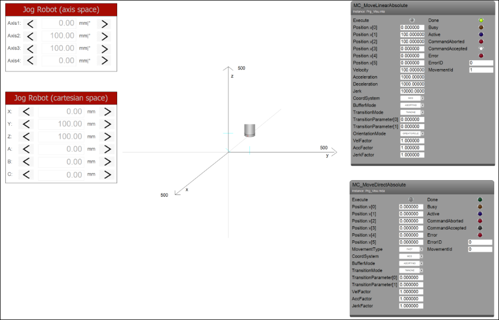

# Using the library in a project (CustomKinematics\_Implementation.project)

The project demonstrates how to use and control the kinematics created in the previous section by jogging or commanding a movement.

1. Create a CODESYS standard project with the CODESYS SoftMotion Win controller.
2. Compile and run the application. Open the visualization. You can jog the robot in axis space as well as in Cartesian space. There are also visualization templates to command a linear or a PTP movement.

   * Result:

     

TIP:

The example described here discusses the positioning and orientation axes in a common function block. Many kinematics can comprise two decoupled partial kinematics: one positioning kinematic (delta, gantry, etc.) and one orientation kinematics (tools like C-axis, Wrist2, Wrist3, etc.). Both kinematics are connected to each other at the "flange point", the TCP of the positioning kinematics. The orientation kinematics is characterized by the fact that it is able to calculate the vector from the flange point to the TCP of the coupled kinematics. The calculation is done using only the orientation of this TCP (meaning that it is independent of the positioning kinematics or independent of the orientation of the flange point). The positioning kinematics in turn has to be able to determine its axis positions from only the position of the flange point. It must not depend on the orientation of the flange point.

In this case, you can resort to interfaces such as `ISMPositionKinematics` or `ISMOrientationKinematics`. To implement these interfaces, define one function block to implement `ISMPositionKinematics` and another function block to implement `ISMOrientationKinematics`. Finally, define a function block that extends the function block `Kin_Coupled` (from `SM3_Transformation`) with the previously defined function blocks as inputs.

For more information, see the following: [Creating Custom Kinematics](_sm_kinematic_transformations.html#_sm_kinematic_transformations)

15.0

© Copyright 2026, CODESYS GmbH