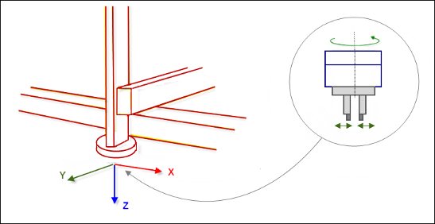

# Custom Kinematics

See the `CustomKinematics_Implementation.project` sample project and the `CustomKinematics.library` library in the installation directory of CODESYS under `..\CODESYS SoftMotion\Examples.`

This example describes how to create a library with a custom kinematic transformation (`Gantry3C`) and how to use this library in a project to control the robot.

The `Gantry3C` kinematic transformation consists of 3 linear axes (X, Y, and Z) which carry a tool head. The tool head consists of an extra axis which carries a mounted tool. The tool head can be rotated around the Z-axis.

15.0

© Copyright 2026, CODESYS GmbH