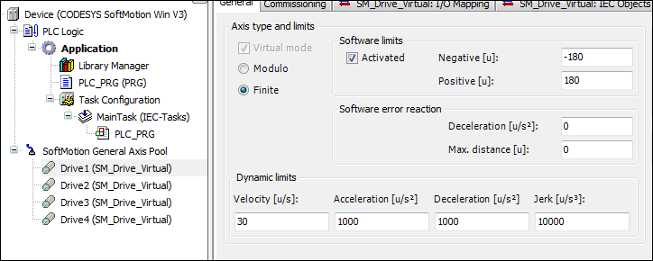

# Adding and parameterizing the axes

1. Insert four virtual axes below the object **SoftMotion General Axis Pool** and name the axes as Drive1...Drive4.
2. Parameterize the axes Drive1, Drive2, Drive3, and Drive4 as axis type **finite** with software limit switches from -180 degrees to 180 degrees.

   * Configuration editor:

     

For more information, see: [Virtual Drive](_sm_drive_controller_virtual_axis.html#_sm_drive_controller_virtual_axis)

15.0

© Copyright 2026, CODESYS GmbH