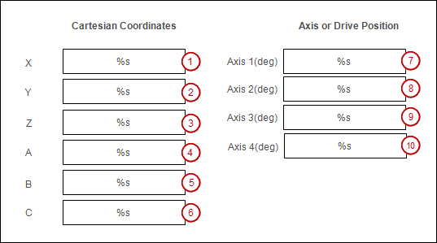

# Creating visualizations

Create a visualization screen in which the Cartesian coordinates and the axis coordinates can be displayed and modified.

1. Add a "Visualization" object below the application. To do this, click **Project → Add Object → Visualization**.
2. Label the visualization elements with the **Label** element.

15.0

© Copyright 2026, CODESYS GmbH