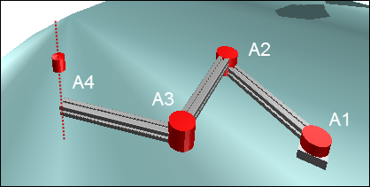

# Using Depictor to Visualize Axis Groups

For this project, you also need the CODESYS Depictor add-on with a valid license.

The SoftMotion application consists of four rotary drives configured as an axis group. The first three axes move the TCP in the X/Y-plane, and the fourth axis in the Z-plane.

The example demonstrates how you can use Depictor with the Kin\_Scara3\_Z kinematic configuration. You can also customize the same procedure for other kinematic configurations.

15.0

© Copyright 2026, CODESYS GmbH