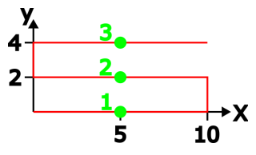

# Trigger Example 2: Gluing Process

The `Robotics_Trigger_Advanced.project` sample project described here is located in the installation directory of CODESYS under`..\CODESYS SoftMotion\Examples`.

Triggers can be used to perform actions at specific positions on the path, such as switching a gluing nozzle on and off.

This example includes the following components:

* The configuration of a guaranteed forecast of the trajectory by the `fPlanningForecastDuration` parameter from the `SMC_TuneCPKernel` function block.
* The commanding of different triggers. Here, all three available methods for defining the path position are used (see SMC\_TriggerPositionType).
* The use of triggers with time shift. The sample application contains the `TriggerWithTimeShift` function block, which can react to reaching the path position with a time offset (earlier and later).

These components are shown in a sample application for a gluing process. The movement displayed in red in the following image is executed (with blending).

Triggers have been defined at the positions marked in green:

* Position 1: Switch on the gluing device 0.05 s before reaching the position.
* Position 1: Switch on the UV lamp when the position is reached.
* Position 2: Fill the glue supply container when the position is reached.
* Position 3: Switch off the gluing device and stop filling the glue supply container 0.05 s before reaching the position.
* Position 3: Switch off the UV lamp 1.5 s after reaching the position

15.0

© Copyright 2026, CODESYS GmbH