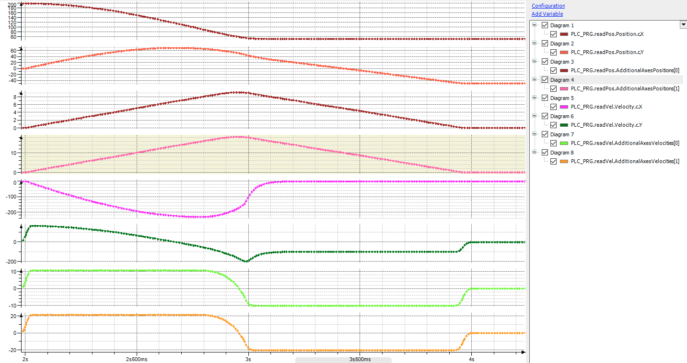

# Structure of the application

The axis group is configured in the **AxisGroup** object. A SCARA robot with 3 axes (two rotary axes and one linear Z-axis) is used.

Two additional axes have also been added below **Additional Axes** and linked to the two axes `DriveAdd1` and `DriveAdd2`.

The `PLC_PRG` program contains a simple state machine for the program flow. First the axis group is enabled in state `0`, and then a PTP movement to position `(X=50, Y=50)` is performed. This is then blended into a linear movement to position `(X=50, Y=-50)`.

For the first robot movement, a relative additional axis movement with distance `(10, 20)` is commanded. For the second robot movement, the distance of the additional axis is `(-10, -20)`.

The `MC_GroupReadActualPosition` and `MC_GroupReadActualVelocity` function blocks are used to read the position and velocity of the kinematics and of the additional axes.

15.0

© Copyright 2026, CODESYS GmbH