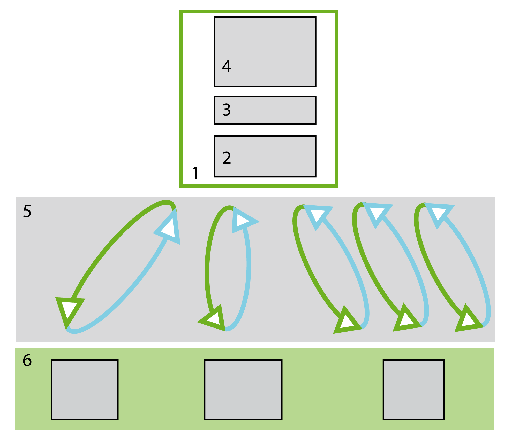

# Principles

## Overview

The controller controls Industrial Ethernet operating mode management. This management is performed using stable and cyclic data exchanges (scanner service).

Scanner services are available for the following protocols:

* [EtherNet/IP](../../../../../api/crossBook?lang=en-US&virtualBookName=ESMEEtherNetIP&topicID=D_SE_0093828)
* [Modbus TCP](../../../../../api/crossBook?lang=en-US&virtualBookName=ESMEModbusTCP&topicID=D_SE_0093829)

## Scanner Principle

Industrial Ethernet scanner principle:

**1** [Controller](D-SE-0056503.html#D-SE-0056503)

**2** I/O images

**3** Application interface

**4** Application

**5** Data exchanges in Modbus channels or EtherNet/IP connections

**6** [Slave devices](D-SE-0056504.html#D-SE-0056504)

## Data Exchanges

Controller manages (for each supported protocol):

* Cyclic data exchanges
* Non-cyclic data exchanges

Cyclic data exchange (example: implicit messages in EtherNet/IP) is used when data must be exchanged at a constant rate such as:

* Scanning various I/O modules
* Updating a variable speed drive
* Reading input data on sensors

Non-cyclic data exchange (example: implicit messages in EtherNet/IP) is typically used to obtain on-demand information from the target devices, such as:

* Configuration
* Diagnostics
* Data collection

EIO0000003053.03