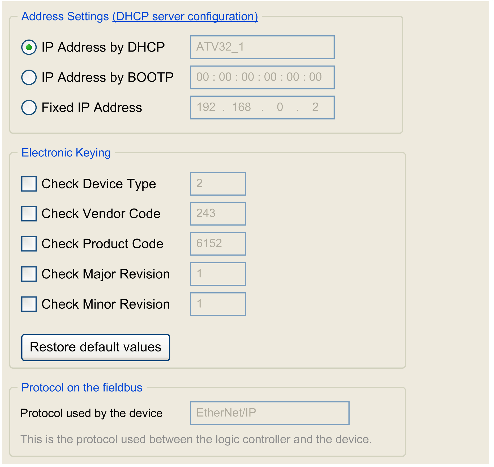

# EtherNet/IP Target Settings

## Overview

Once the devices are added in the protocol manager, use its Target Settings tab to edit the network planning.

## EtherNet/IP Target Settings

In the Devices tree, double-click an EtherNet/IP device node:

The Address Settings values are the same as those defined in the protocol manager. Refer to [Adapting Network Planning and Device Identification](D-SE-0056549.html#D-SE-0056549__D-SE-0056549.4).

## Electronic Keying

Electronic Keying signatures are used to identify the device.

Electronic Keying is information contained in the firmware of the device (Vendor Code, Product Code, …).

When the scanner starts, it compares each selected electronic keying value with the corresponding information in the device.

If the device values are not the same as the application values, the controller no longer communicates with the device.

Electronic Keying values are set by default according to the preconfigured devices. You can modify these values.

For Electronic Keying values, refer to the Identity Object (F1 hex) description in the documentation of the device.

EIO0000003818.03