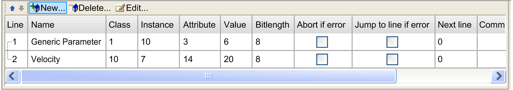
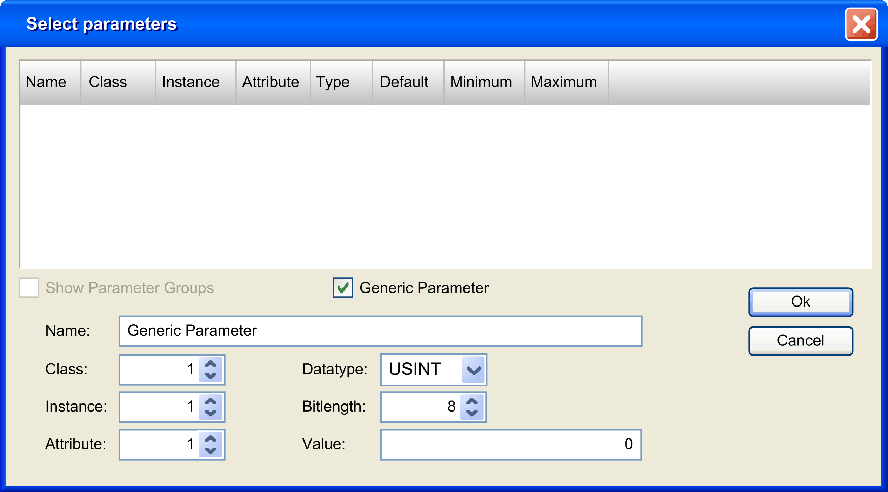

# Device Replacement with User Parameters

## Overview

For EtherNet/IP devices that do not support the FDR service, you can configure User Parameters that are sent to the device to facilitate device replacement just before the scanner connection is started after:

* Application download
* Reset warm/cold start
* Manual start of a connection

Some EtherNet/IP devices have predefined User Parameters.

The User Parameters tab allows you to add and manage other parameters.

For maintenance details, refer to [Apply the Correct Device Configuration](D-SE-0057261.html#D-SE-0057261).

## User Parameters

In the Devices tree, double-click an EtherNet/IP device and select the User Parameters tab:

| Column | Description |
| --- | --- |
| Line | Line number.  Indicates the order of the parameters loaded to the device. |
| Name | Name of the parameter. |
| Class | Class ID(1) of the class corresponding to the object. |
| Instance | Instance ID(1) of the instance corresponding to the object. |
| Attribute | Attribute ID(1) of the attribute corresponding to the object. |
| Value | Value of the parameter.  Double-click the value to modify it. If applicable, a list opens containing possible values. |
| Bitlength | Number of bits of the parameter.  Automatically changed depending of the parameter datatype selected. |
| Abort if error | If selected, when an error is detected, the transmission of the parameters is aborted. |
| Jump to line if error | If selected, when an error is detected, the program resumes with the line specified in the Next line column. A block can thus be skipped during the initialization, or a return can be defined.  NOTE: A return can lead to an endless loop if it is never possible to write a certain parameter. |
| Next line | Double-click to enter the line to jump to (if Jump to line if error is selected). |
| Comment | Double-click to enter a comment. |
| **(1)** The Class ID, Instance ID, and Attribute ID can be found in the device documentation. Refer to [How To Find User Parameter Information](#D-SE-0056941__D-SE-0056941.8). | |

| Icons | Description |
| --- | --- |
| Move up | Move up the selected parameter in the parameters list. |
| Move down | Move down the selected parameter in the parameters list. |
| New | Creates a new parameter. |
| Delete | Delete the selected parameter. |
| Edit | Edit the selected parameter. |

## Creating or Configuring User Parameters

Click New, or select a parameter and click Edit:

| Fields | Description |
| --- | --- |
| Name | Name of the parameter. |
| Class | Class ID(1) of the class corresponding to the type of object. |
| Instance | Instance ID(1) of the instance corresponding to an implementation of a class. |
| Attribute | Attribute ID(1) of the attribute corresponding to a characteristic of an instance. |
| Datatype | List containing the possible data type. |
| Bitlength | Number of bits of the parameter.  Automatically changed depending on the selected Datatype. |
| Value | Value of the parameter. |
| **(1)** The Class ID, Instance ID, and Attribute ID can be found in the device documentation. Refer to [How To Find User Parameter Information](#D-SE-0056941__D-SE-0056941.8). | |

## How To Find User Parameter Information

Configurable user parameter information is provided in the device documentation. It is usually part of the description of application objects, explicit messaging, or objects belonging to EtherNet/IP category 3.

User parameter write access is usually specified for the class and/or instance to which the user parameter belongs. The write operation is typically performed using a service called Set\_Attribute\_Single or Write one attribute. Alternatively, a service identifier 0x10 (hexadecimal) or 16 (decimal) may be supported.

A user parameter always has the following numeric properties:

* Class, or Class ID, usually expressed as an hexadecimal value
* Instance, or Instance ID, usually expressed as an hexadecimal value
* Attribute, or Attribute ID, usually expressed as an hexadecimal value

A user parameter may also have an identifier, expressed in the form of a decimal triplet (xx/yy/zz) or hexadecimal triplet (16#xx/yy/zz).

EIO0000003818.03