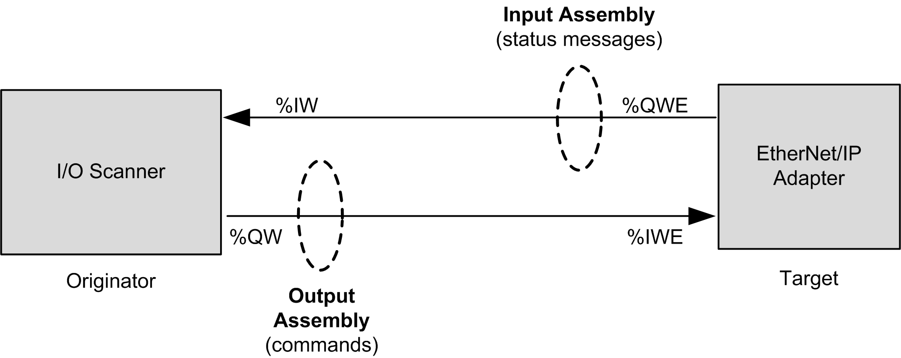
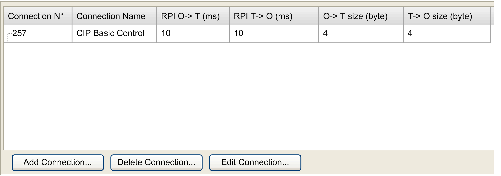
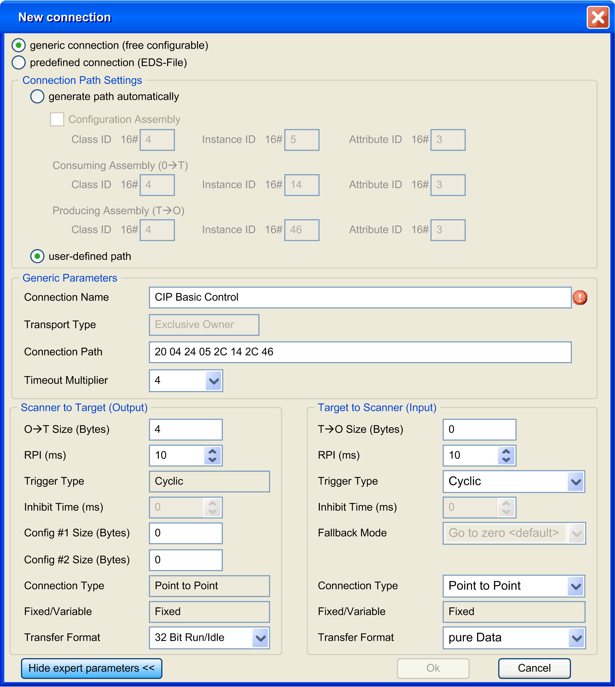

# EtherNet/IP Cyclic Data Exchanges Configuration

## Connection Overview

To access an EtherNet/IP device, it is necessary to start a connection (global name used by EtherNet/IP protocol level).

A connection allows to transfer data combined into [assembly](#D-SE-0056942__D-SE-0056942.14).

The connections processes (start/stop) are automatically managed by the controller.

For connections limitations, refer to the controller Programming Guide.

For more details, refer to [protocol manager Operating Modes](D-SE-0057099.html#D-SE-0057099).

## Assembly

I/O data and configuration data can be combined into Assembly Objects.

Data (attributes) from different objects can be combined into a single object to allow data to be sent or received over a single connection.

Assembly Object instances are used to aggregate data for the input data and output data associated with I/O connections.

Assembly objects are structured into classes, instances, and attributes:

* A class is a set of objects that represent the same kind of system component.
* An object instance is the representation of a particular object within a class. Each instance has its own set of attribute values.
* Attributes are characteristics of an object and/or an object class. Typically, attributes provide status information or define the operation of an object.

The following graphic presents the directionality of Input Assembly and Output Assembly in EtherNet/IP communications:

The EtherNet/IP configuration parameters are defined as:

* **Instance:** Number referencing the assembly.
* **Size:** Number of channels of an assembly.

  The memory size of each channel is 2 bytes, which store the value of `%IWx` or `%QWx` objects, where x is the channel number.

For example, if the Size of the Output Assembly is 20, there are 20 input channels (IW0…IW19) addressing `%IWy…%IW(y+20-1)`, where y is the first available channel for the assembly.

## EtherNet/IP Device Connection Tab

Each EtherNet/IP device has connections.

In the Devices tree, double-click an EtherNet/IP device and select the Connections tab.

| Column | Comment |
| --- | --- |
| Connection N° | The connection number is unique. It is automatically assigned by EcoStruxure Machine Expert. |
| Connection Name | The connection name is generated automatically by EcoStruxure Machine Expert. |
| RPI O --> T (ms) | Requested Packet Interval: The time period between cyclic data transmissions requested by the scanner. |
| RPI T --> O (ms) |
| O->T size (byte) | Number of bytes to exchange between the Originator (O) and the Target (T). |
| T->O size (byte) |
| Config#1 size (byte) | Number of bytes of configuration parameters to transfer.  Displayed if the connection contains a [configuration assembly](#D-SE-0056942__D-SE-0056942.16). |
| Config#2 size (byte) |

I/O states are refreshed every cycle if the RPI for the connection associated with the device is set to a value greater than the period of the application task updating this I/O. It also applies for the first application task cycles after connection establishment.

| WARNING | |
| --- | --- |
|  | UNINTENDED EQUIPMENT OPERATION  Do not increase the RPI value to a value greater than the period of the application task cycle time updating the device I/Os.  Failure to follow these instructions can result in death, serious injury, or equipment damage. |

To create a connection, click Add Connection.

To modify a connection, select a connection and click Edit Connection, or double-click on it.

To remove a connection, select a connection and click Delete Connection.

## Add an EtherNet/IP Connection

To configure an EtherNet/IP connection, proceed as follows:

| Step | Action |
| --- | --- |
| 1 | In the Devices tree, double-click an EtherNet/IP device. |
| 2 | Select the Connections tab. |
| 3 | Click Add Connection. |
| 4 | Select generic connection (free configurable): |
| 5 | Select generate path automatically. |
| 6 | Select [**Configuration assembly**](#D-SE-0056942__D-SE-0056942.16). |
| 7 | Configure the Consuming assembly (O --> T):   * Class ID (4 by default): Class identifier(1) * Instance ID: Instance identifier(1) * Attribute ID (3 by default): Attribute identifier(1) |
| 8 | Configure the Producing assembly (T --> O):   * Class ID (4 by default): Class identifier(1) * Instance ID: Instance identifier(1) * Attribute ID (3 by default): Attribute identifier(1) |
| 9 | Select the Timeout Multiplier: 4 (default) / 8 / 16 / 32 / 64 / 128 / 256 / 512 |
| 10 | Configure the Scanner to Target (Output):   * O --> T Size (Bytes): Number of bytes to transfer: up to 505 * Trigger Type: Cyclic * RPI (ms) (10 ms by default): The time period between cyclic data transmissions requested by the scanner. |
| 11 | Configure the Target to Scanner (Input):   * T --> O Size (Bytes): Number of bytes to transfer (Number of channels of the assembly): up to 509) * Trigger Type: Cyclic/Change of state. If Change of state is selected, then Inhibit Time is enabled and set to the default value of 2 ms * RPI (ms) (10 ms by default): The time period between cyclic data transmissions requested by the scanner * Inhibit Time (ms) (2 ms by default): Minimum period of time between 2 data exchanges. Accessible if Trigger Type is Change of state. The value must be a multiple of 2 ms. The maximum value is the target to scanner RPI (ms) value, up to a maximum possible value of 254 ms. |
| 12 | Click OK. |
| **(1)** The Class ID, Instance ID, and Attribute ID can be found in the device documentation. Refer to [How To Find Assembly Information](#D-SE-0056942__D-SE-0056942.17). | |

For more details on supported assemblies, refer to the documentation of the device.

For more details on advanced parameters, refer to EtherNet/IP [Connection Properties in Expert Mode](#D-SE-0056942__D-SE-0056942.13).

NOTE: Due to the O --> T Size (Bytes) and T --> O Size (Bytes) limitations and the maximum input/output words of the scanner, verify the [scanner resources overload](D-SE-0056944.html#D-SE-0056944).

## Add a Predefined Connection

Predefined connections are available for:

* [Predefined devices](../../../../../api/crossBook?lang=en-US&virtualBookName=ESMEIndEthOverview&topicID=D_SE_0056504).
* Devices that are supported by DTM.
* Devices that are delivered with an EDS file.

By definition, generic slave devices do not have predefined connections.

To add a predefined EtherNet/IP connection, proceed as follows:

| Step | Action |
| --- | --- |
| 1 | In the Devices tree, double-click an EtherNet/IP device. |
| 2 | Select the Connections tab. |
| 3 | Click Add Connection. |
| 4 | Select predefined connection (EDS-File): |
| 4 | Select one of the predefined connections. |
| 5 | Select the Timeout Multiplier: 4 (default) / 8 / 16 / 32 / 64 / 128 / 256 / 512 |
| 6 | Configure the Scanner to Target (Output):   * O --> T Size (Bytes): Number of bytes to transfer * Trigger Type: Cyclic * RPI (ms) (default value is defined in the EDS): The time period between cyclic data transmissions requested by the scanner. |
| 7 | Configure the Target to Scanner (Input):   * T --> O Size (Bytes): Number of bytes to transfer (Number of channels of the assembly) * Trigger Type: Cyclic/Change of state. If Change of state is selected, then Inhibit Time is enabled and set to the default value of 2 ms * RPI (ms) (default value is defined in the EDS): The period of time between cyclic data transmissions requested by the scanner * Inhibit Time (ms) (2 ms by default): Minimum period of time between 2 data exchanges. Accessible if Trigger Type is Change of state. The value must be a multiple of 2 ms. The maximum value is the target to scanner RPI (ms) value, up to a maximum possible value of 254 ms. |
| 8 | Click OK. |

## Configure a Configuration Assembly

Some devices support a configuration assembly.

A configuration assembly is a request, sent at the scanner start, that loads configuration parameters to the device in a single request.

To configure a configuration assembly, proceed as follows:

| Step | Action |
| --- | --- |
| 1 | In the Devices tree, double-click an EtherNet/IP device. |
| 2 | Select the Connections tab. |
| 3 | Select an existing connection and click Edit Connection. |
| 4 | Select generate path automatically. |
| 5 | Select Configuration Assembly. |
| 6 | Configure the Configuration Assembly:   * Class ID (4 by default): Class identifier(1) * Instance ID: Instance identifier(1) * Attribute ID (3 by default): Attribute identifier(1) |
| 7 | Click Show all parameters >>>. |
| 8 | Configure the Scanner to Target (Output):   * Config#1 Size (Bytes): Number of the first set of configuration parameters. * Config#2 Size (Bytes): Number of the second set of configuration parameters. |
| 9 | Click OK.  **Result:** The configuration parameters are displayed in the Connections tab: |
| 10 | Double-click in the Value column to set the configuration parameter values. |
| **(1)** The Class ID, Instance ID, and Attribute ID can be found in the device documentation. Refer to [How To Find Assembly Information](#D-SE-0056942__D-SE-0056942.17). | |

## EtherNet/IP Connection Properties

Edit connection with advanced parameters view:

Connection settings:

| Parameter | | | Values | Description |
| --- | --- | --- | --- | --- |
| Generate path automatically | | | Yes/No | Enables you to configure the parameters of the assemblies. |
|  | Configuration assembly | | True/False | Enables you to configure a [configuration assembly](#D-SE-0056942__D-SE-0056942.16). |
|  | Class ID | 2 bytes (04h by default) | Class identifier(1) |
| Instance ID | 2 bytes (0 by default) | Instance identifier(1) |
| Attribute ID | 2 bytes (03h by default) | Attribute identifier(1) |
| Consuming Assembly (O --> T) | | | |
|  | Class ID | 2 bytes (04h by default) | Class identifier(1) |
| Instance ID | 2 bytes (0 by default) | Instance identifier(1) |
| Attribute ID | 2 bytes (03h by default) | Attribute identifier(1) |
| Producing Assembly (T --> O) | | | |
|  | Class ID | 2 bytes (04h by default) | Class identifier(1) |
| Instance ID | 2 bytes (0 by default) | Instance identifier(1) |
| Attribute ID | 2 bytes (03h by default) | Attribute identifier(1) |
| User-defined path | | | Yes/No | Disable the Generate path automatically area and enable the Connection Path field |
| **(1)** The Class ID, Instance ID, and Attribute ID can be found in the device documentation. Refer to [How To Find Assembly Information](#D-SE-0056942__D-SE-0056942.17). | | | | |

Generic Parameters:

| Parameter | Values | Description |
| --- | --- | --- |
| Connection Path | Array of bytes | Coded transcription of the physical link object. |
| Transport Type | * Exclusive Owner (default) * Listen Only * Input Only | Exclusive Owner: This is a bidirectional connection to an Output connection point (typically an Assembly Object), where the data of this assembly can only be controlled by one Scanner. There may be a connection to an input assembly; this data is being sent to the scanner. If the input data length is zero, then this direction becomes a Heartbeat connection.  Listen only: The scanner receives input data from the target device and produces a Heartbeat to the target device. There is no Output data. A Listen Only Connection can only be attached to an existing Exclusive Owner or Input Only Connection. If this underlying connection stops, then the Listen Only connection is also stopped or timed out.  Input Only: The scanner receives input data from the target device and produces a Heartbeat to the target device. There is no Output data. |
| Timeout Multiplier | 4 (default) / 8 / 16 / 32 / 64 / 128 / 256 / 512 | [Scanner Timeout](D-SE-0056936.html#D-SE-0056936) is managed connection by connection with RPI and timeout multiplier. |

Scanner to Target (Output):

| Parameter | Values | Description |
| --- | --- | --- |
| O --> T Size (Bytes) | 0 to XX => device specific | Size of channel for an assembly.  The memory size of each channel is 2 bytes that stores the value of %IWx or %QWx object, where x is the channel number. |
| RPI (ms) | In ms (10 ms by default) | Requested Packet Interval. The time period between cyclic data transmissions requested by the scanner.  The device always provides a minimum RPI, whereas in the controller the goal is to have the highest RPI in order to not overload the system. Each time a device is added to the EtherNet/IP fieldbus, or each time a RPI value is modified, it is recommended to check the resources (refer to the [scanner resource checker](D-SE-0056944.html#D-SE-0056944)).  The device RPI may be specified in the device documentation. Usually, however, this information is provided as part as the [EDS file](D-SE-0056548.html#D-SE-0056548__D-SE-0056548.9) delivered with the device. |
| Trigger Type | Cyclic | **Cyclic:** Endpoints send their messages at pre-determined cyclic time intervals |
| Inhibit Time | 0 ms | Used for change of state trigger type. |
| Config#1 Size (Bytes) | 0 to XX => device specific | Accessible if connection path contains a configuration assembly.  Numbers of parameter (1 byte) to transfer.  The configuration values are sent to the device at the scanner start. |
| Config#2 Size (Bytes) | 0 to XX => device specific |
| Connection Type | Point to Point | Connection type of the request |
| Fixed/Variable | Fixed | The request length is fixed. |
| Transfer format | * 32 bit Run-idle (by default) * pure Data * Heartbeat | Transfer format of the request. For more information, refer to [ODVA website](http://www.odva.org/Home/ODVATECHNOLOGIES/EtherNetIP/EtherNetIPLibrary.aspx). |
| NOTE: If transfer format is set to 32 bit Run-idle, the scanner status is sent in the request. Targets may not respond in the same manner when they receive the information that the scanner is in IDLE status. For example, some targets may not update their inputs while others do when the controller is `STOPPED` or `HALT`. | | |

Target to Scanner (Input):

| Parameter | Values | Description |
| --- | --- | --- |
| T --> O Size (Bytes) | 0 to XX => device specific | Size of channel of an assembly.  The memory size of each channel is 2 bytes that stores the value of %IWx or %QWx object, where x is the channel number. |
| RPI (ms) | In ms (10 ms by default) | Requested Packet Interval. The time period between cyclic data transmissions requested by the scanner.  The device is always providing a minimum RPI, whereas in the controller the goal is to have the highest RPI in order to not overload the system. Each time a device is added to the EtherNet/IP fieldbus, or each time a RPI value is modified, it is recommended to check the resources (refer to the [scanner resource checker](D-SE-0056944.html#D-SE-0056944)).  The device RPI may be specified in the device documentation. Usually, however, this information is provided as part as the [EDS file](D-SE-0056548.html#D-SE-0056548__D-SE-0056548.9) delivered with the device. |
| Trigger Type | * Cyclic (default) * Change of state | **Cyclic:** Endpoints send their messages at pre-determined cyclic time intervals  **Change of state:** Change of state endpoints send their messages when a change occurs. The data is also sent at a background cyclic interval (RPI) if no change occurs to keep the connection from timing out. |
| Inhibit Time (ms) | In multiples of 2 ms (2 ms by default) | Minimum period time between 2 data exchanges.  Accessible if Trigger Type is Change of state. Inhibit Time maximum value is RPI and is limited to 254 ms. |
| Fallback Mode | Go to zero <default> | Reset the input on error/stop |
| Connection Type | * Multicast (default) * Point to Point | Connection type of the request |
| Fixed/Variable | Fixed | The request length is fixed. |
| Transfer format | * pure Data (by default) * Heartbeat | Transfer format of the request. For more information, refer to [ODVA website](http://www.odva.org/Home/ODVATECHNOLOGIES/EtherNetIP/EtherNetIPLibrary.aspx). |

## How to Find Assembly Information

Assembly information is provided in the device documentation. It is usually part of the description of assembly objects.

To configure an assembly, identify the following items of information:

1. Class ID

   The "Assembly object" Class ID is equal to 4.
2. Instance ID

   Select the assembly instance, depending on the application and on the type of device. The selection of the assembly instance will induce a dedicated state machine in the device:

   * **Configuration assembly**: Supported by few devices; verify in the device documentation which assembly instance is supported.
   * **Consuming assembly**: sometimes referred to as “device output” in the device documentation (from the device point of view).
   * **Producing assembly**: sometimes referred to as “device input“ in the device documentation (from the device point of view).
3. Attribute ID

   Search for the attribute to read. This corresponds to the data buffer exchanged during the connection.

   The attribute property must have write access for the producing assembly and read access for the consuming assembly.

   The attribute ID is the same for the two assemblies and equal to 3. It matches an attribute whose access is Get/Set. The name is often "data", and the type of data “Array of byte”.

EIO0000003818.03