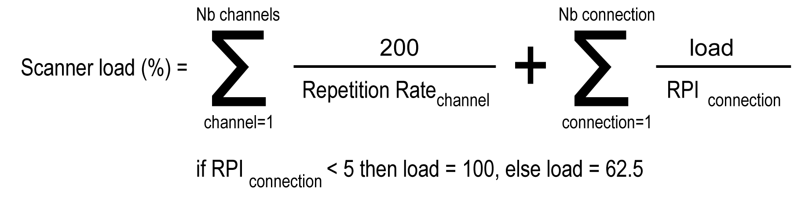
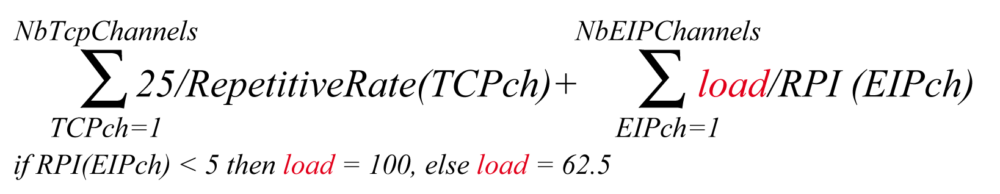
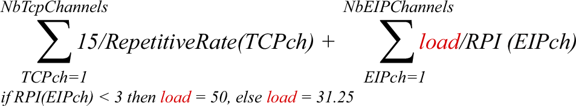
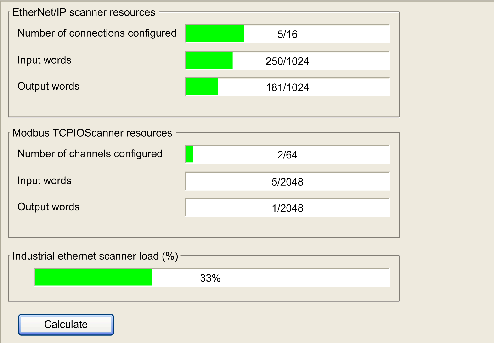

# Protocol Manager Load Verification

## Purpose

If the load on the protocol manager exceeds 100%, cyclic data exchanges might not be processed at the configured rate.

The Ethernet Resources tab allows you to estimate the load on the protocol manager.

Verify this load before operating the machine.

To manage the load, you can manipulate one or more of the following load factors:

* Number of slaves
* With EtherNet/IP:

  + Number of connections (on the EtherNet/IP Scanner)
  + The RPI of the connections

## Load Estimation

This equation allows estimation of the load on the protocol manager of the TM241CE••• and TM251MES• if it manages at least one Ethernet/IP device:

This equation allows estimation of the load on the protocol manager of the TM262L01MESE8T, TM262L10MESE8T, TM262M05MESS8T and TM262M15MESS8T if it manages EtherNet/IP or Modbus TCP IOScanner device:

This equation allows estimation of the load on the protocol manager of the TM262L20MESE8T, TM262M25MESS8T and TM262M35MESS8T if it manages EtherNet/IP or Modbus TCP IOScanner device:

NOTE: If you use Sercos communication, the resources are not calculated.

This load estimate does not take into account increases in load resulting from [out of process data exchanges](D-SE-0056605.html#D-SE-0056605) such as:

* DTM, Web server, and Modbus TCP requests.
* fieldbus communications (DTM, Web server communications when the PC is on the fieldbus)
* TCP UDP communications generated by the TcpUdpCommunications library.

In EcoStruxure Machine Expert, an automatic load calculation is available:

| Step | Action |
| --- | --- |
| 1 | In the Devices tree, double-click the protocol manager node. |
| 2 | If you use a M262 controller, select Ethernet Services > Ethernet Resources. |
| 3 | Click Calculate. |

This picture presents the Ethernet Resources tab:

EIO0000003818.03