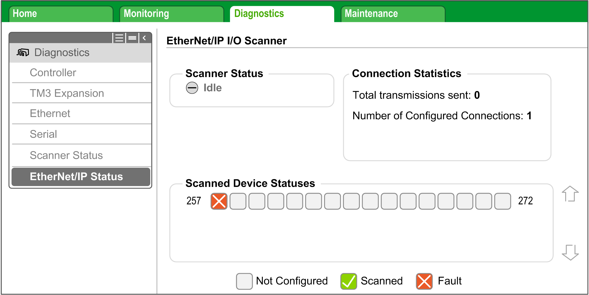

# Diagnostics: Web Server

## Overview

The Web server of the controller has a diagnostic tab.

In this tab, you can access to Industrial Ethernet diagnostic pages:

* Ethernet [diagnostic page](#D-SE-0056614__D-SE-0056614.12)
* EtherNet/IP [diagnostic page](#D-SE-0056614__D-SE-0056614.14)

## Ethernet Page

Click Ethernet to display Ethernet information of the controller and to allow you to test communication with a specific IP address:

This table presents the ping test result on the Ethernet page:

| Icon | Meaning |
| --- | --- |
|  | The communication test is successful. |
|  | The controller is unable to communicate with the defined IP address. |

## EtherNet/IP Status Page

Click EtherNet/IP Status to display the EtherNet/IP Scanner status (IDLE, STOPPED, OPERATIONAL) and the health bit of up to 16 EtherNet/IP target devices:

257…272 corresponds to the connection ID.

This table presents the status of each connection presented on the EtherNet/IP Status page:

| Icon | Health bit value | Meaning | Scanner status |
| --- | --- | --- | --- |
|  | 1 | Communications are ongoing on time. | STOPPED or OPERATIONAL. |
|  | 0 | An error is detected, the communications are closed. | STOPPED or OPERATIONAL. |
|  | – | This ID does not correspond to a configured connection. | STOPPED or OPERATIONAL. |

NOTE: Click any icon to open the network device Web server (if existing). To access this Web server, the computer must be able to communicate with the device. For more information, refer to [PC routing](D-SE-0056605.html#D-SE-0056605__D-SE-0056605.4).

If the EtherNet/IP Scanner status is IDLE, no icon is displayed; **No scanned device reported** is displayed.

EIO0000003818.03