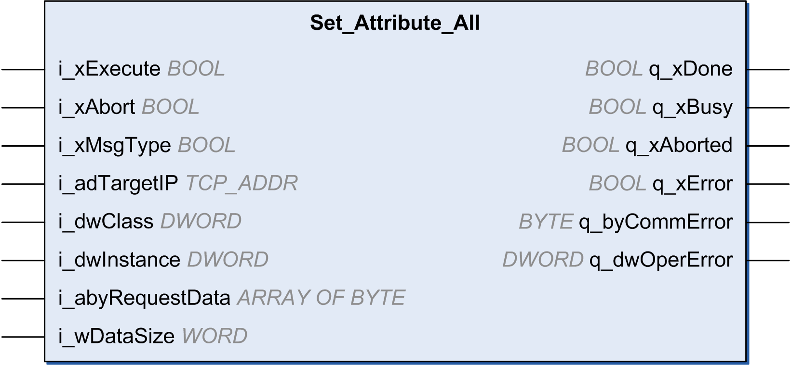

# Set\_Attribute\_All: Set All Attributes of an Instance or Class

## Function Block Description

This function block sets all attributes of an instance or classes.

To use the function block, you must add a at least one EtherNet/IP device under the protocol manager. Refer to [Add a Device](D-SE-0056548.html#D-SE-0056548__D-SE-0056548.10).

## Graphical Representation

## Inputs

This table describes the input variables:

| Input | Data type | Comment |
| --- | --- | --- |
| i\_xExecute | BOOL | Value range: FALSE, TRUE.  Default value: FALSE.  A rising edge of the input Execute starts the function block. The function block continues execution and the output Busy is set to TRUE. Another rising edge of the Execute input while the function block is executing is ignored.   * FALSE: If the input Execute is set to FALSE during the execution of the function block, the output Done or Error is set to TRUE for one cycle. * TRUE: The output Done or Error is set to TRUE as long as the input Execute is set to TRUE. |
| i\_xAbort | BOOL | Value range: FALSE, TRUE.  Default value: FALSE.   * FALSE: Execution has not been aborted. * TRUE: Execution has been aborted by another function block. |
| i\_xMsgType | BOOL | * FALSE: UCCM * TRUE: Connected (Class 3) message |
| i\_adTargetIP | TCP\_ADDR | IP address of target. |
| i\_dwClass | DWORD | Target class.  Refer to [How To Find Object Information in Device Documentation.](D-SE-0061206.html#D-SE-0061206)  It must be 0xFFFFFFFF if the class is not part of the request. |
| i\_dwInstance | DWORD | Target instance.  Refer to [How To Find Object Information in Device Documentation.](D-SE-0061206.html#D-SE-0061206)  It can be 0 if the target is class instance. It must be 0xFFFFFFFF if the instance is not part of the request. |
| i\_abyRequestData | ARRAY OF BYTE  0…MAX\_EIP\_REQUEST\_DATA\_SIZE | Data must be sent to the target. If not used, wDataSize must be 0 1. |
| q\_wDataSize | WORD | The actual size of the abyRequestData (1). |
| **(1)** The input data buffer must be formatted as well. Refer to Set\_Attribute\_All request data in the ODVA EtherNet/IP specification volume 1. | | |

## Outputs

This table describes the output variables:

| Output | Data type | Comment |
| --- | --- | --- |
| q\_xDone | BOOL | Value range: FALSE, TRUE.  Default value: FALSE.   * FALSE: Execution has not been started, or an error has been detected. * TRUE: Execution terminated without an error detected. |
| q\_xBusy | BOOL | Value range: FALSE, TRUE.  Default value: FALSE.   * FALSE: Function block is not being executed. * TRUE: Function block is being executed. |
| q\_xAborted | BOOL | Value range: FALSE, TRUE.  Default value: FALSE.   * FALSE: Execution has not been aborted. * TRUE: Execution has been aborted by Abort input. |
| q\_xError | BOOL | Value range: FALSE, TRUE.  Default value: FALSE.   * FALSE: Execution of the function block is running, no error has been detected. * TRUE: An error has been detected in the execution of the function block. |
| q\_byCommError | BYTE | Gives information about the detected error. Refer to [CommunicationErrorCodes: Communication Error Codes](D-SE-0058092.html). |
| q\_dwOperError | DWORD | Gives information about the detected error. Refer to [OperationErrorCodes: Operation Error Codes](D-SE-0058093.html). |

EIO0000003818.03