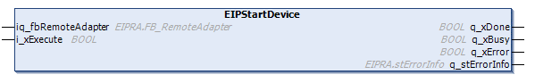

# EIPStartDevice: Enables the Remote Adapter

## Function Block Description

This function block enables the Remote Adapter and starts the connections of a device.

## Graphical Representation

## Inputs

This table describes the input variables:

| Input | Data type | Comment |
| --- | --- | --- |
| i\_xExecute | BOOL | Value range: FALSE, TRUE.  Default value: FALSE.  A rising edge of the input Execute starts the function block. The function block continues execution and the output Busy is set to TRUE. Another rising edge of the Execute input while the function block is executing is ignored.   * FALSE: If the input Execute is set to FALSE during the execution of the function block, the output Done or Error is set to TRUE for one cycle. * TRUE: The output Done or Error is set to TRUE as long as the input Execute is set to TRUE. |

## Inputs / Outputs

This table describes the input / output variables:

| Input / Output | Data type | Comment |
| --- | --- | --- |
| iq\_fbRemoteAdapter | EIPRA.FB\_RemoteAdapter | Remote Adapter of the device to be started. |

## Outputs

This table describes the output variables:

| Output | Data type | Comment |
| --- | --- | --- |
| q\_xDone | BOOL | Value range: FALSE, TRUE.  Default value: FALSE.   * FALSE: Execution has not been started, or an error has been detected. * TRUE: Execution terminated without an error detected. |
| q\_xBusy | BOOL | Value range: FALSE, TRUE.  Default value: FALSE.   * FALSE: Function block is not being executed. * TRUE: Function block is being executed. |
| q\_xError | BOOL | Value range: FALSE, TRUE.  Default value: FALSE.   * FALSE: Execution of the function block is running, no error has been detected. * TRUE: An error has been detected in the execution of the function block. |
| q\_stErrorInfo | EIPRA.stErrorInfo | Provides the error information if the output Error is TRUE. The error information is directly linked to the Remote Adapter library. |

EIO0000003818.03