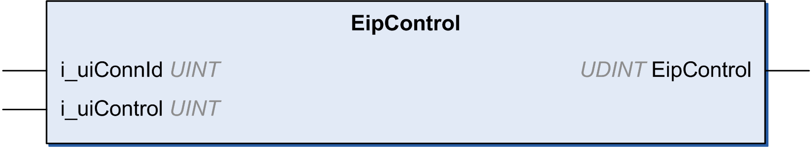

# EipControl: Control the EtherNet/IP Scanner

## Function Description

This function starts or stops one or more EtherNet/IP connection.

The application doesn't manipulate the control bits directly. EipControl function must be used.

The connection ID can be found for each EtherNet/IP target device in its Connections [tab](D-SE-0056942.html#D-SE-0056942).

## Graphical Representation

## IL and ST Representation

To see the general representation in IL or ST language, refer to [Function and Function Block Representation](D-SE-0002384.html#D-SE-0002384).

## I/O Variable Description

This table describes the input variables:

| Input | Type | Comment |
| --- | --- | --- |
| i\_uiConnId | UINT | [Connection ID](D-SE-0056942.html#D-SE-0056942) of the connection monitored. |
| i\_uiControl | UINT | * 0 = Start specified connection * 1 = Stop specified connection * 2 = Start all connections * 3 = Stop all connections |

This table describes the output variable:

| Output | Type | Comment |
| --- | --- | --- |
| EipControl | UDINT | * 0 = successful start or stop * -1 = incorrect connection ID |

## Example

This is an example of a call of this function:

rc := EipControl(0,257) ;(\* opens the connection No 116 \*)

IF rc <> 0 THEN (\* Abnormal situation to be processed at application level \*)

EIO0000003818.03