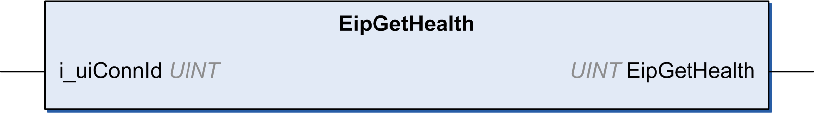

# EipGetHealth: Read the Health Bit Value

## Function Description

This function returns the health bit value of a specific EtherNet/IP connection.

The connection ID can be found for each EtherNet/IP target device in its Connections [tab](D-SE-0056942.html#D-SE-0056942).

## Graphical Representation

## IL and ST Representation

To see the general representation in IL or ST language, refer to [Function and Function Block Representation](D-SE-0002384.html#D-SE-0002384).

## I/O Variable Description

This table describes the input variable:

| Input | Type | Comment |
| --- | --- | --- |
| i\_uiconnId | UINT | [Connection ID](D-SE-0056942.html#D-SE-0056942) of the connection monitored. |

This table describes the output variable:

| Output | Type | Comment |
| --- | --- | --- |
| EipGetHealth | UINT | * 0: Connection not established * 1: Connection established |

## Example

This is an example of a call of this function:

conID:=257 ;

channelHealth := EipGetHealth(conID)(\* Get the health value (1=OK, 0=Not OK) of the connection number conID. The connection ID is displayed in the configuration editor of the device \*)

EIO0000003818.03