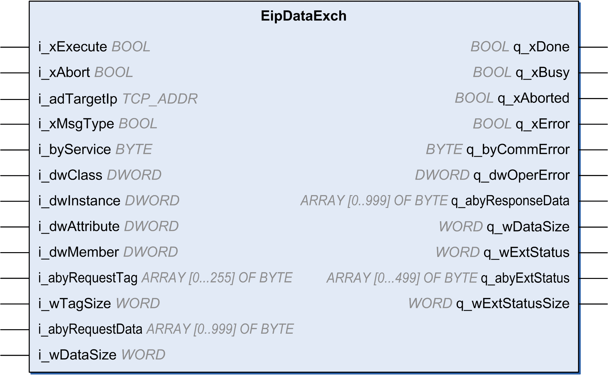

# EipDataExch: Send an Explicit Message

## Function Block Description

This function block sends an explicit message.

The time to perform the operation is configurable from the [protocol manager](D-SE-0056936.html#D-SE-0056936).

There is a timeout value for connected messages and a timeout value for unconnected messages.

This generic function block may be used for features not implemented in the EtherNet/IP Explicit messaging Library.

To use the function block, you must add a at least one EtherNet/IP device under the protocol manager. Refer to [Add a Device](D-SE-0056548.html#D-SE-0056548__D-SE-0056548.10).

## Graphical Representation

## IL and ST Representation

To see the general representation in IL or ST language, refer to [Function and Function Block Representation](D-SE-0002384.html#D-SE-0002384).

## I/O Variable Description

This table describes the input variables:

| Input | Type | Inherited from | Comment |
| --- | --- | --- | --- |
| i\_xExecute | BOOL | BASE | Default value: FALSE.  A rising edge of the input Execute starts the function block. The function block continues execution and the output Busy is set to TRUE. Another rising edge of the Execute input while the function block is executing is ignored.   * FALSE: If the input Execute is set to FALSE during the execution of the function block, the output Done or Error is set to TRUE for one cycle. * TRUE: The output Done or Error is set to TRUE as long as the input Execute is set to TRUE. |
| i\_xAbort | BOOL | BASE | Default value: FALSE.   * FALSE: Execution has not been aborted. * TRUE: Execution has been aborted by another function block. |
| i\_xMsgType | BOOL | - | * FALSE: UCCM * TRUE: Connected (Class 3) message |
| i\_adTargetIP | [TCP\_ADDR](D-SE-0057243.html#D-SE-0057243) | - | IP address of target |
| i\_byService | BYTE | - | Service to be performed (service code see above) |
| i\_dwClass | DWORD | - | Target class.  Refer to [How To Find Object Information in Device Documentation](D-SE-0061206.html#D-SE-0061206).  Must be 0xFFFFFFFF if the class should not be a part of request |
| i\_dwInstance | DWORD | - | Target instance.  Refer to [How To Find Object Information in Device Documentation](D-SE-0061206.html#D-SE-0061206).  Can be 0 if the target is class instance. Must be 0xFFFFFFFF if the instance should not be a part of request |
| i\_dwAttribute | DWORD | - | Target attribute.  Refer to [How To Find Object Information in Device Documentation](D-SE-0061206.html#D-SE-0061206).  Must be 0xFFFFFFFF if the attribute should not be a part of request |
| i\_dwMember | DWORD | - | Target member.  Refer to [How To Find Object Information in Device Documentation](D-SE-0061206.html#D-SE-0061206).  Must be 0xFFFFFFFF if the member should not be a part of request |
| i\_abyRequestTag | ARRAY OF [0…250] BYTE | - | Target extended symbol segment. If not used i\_wTagSize must be 0 |
| i\_wTagSize | WORD | - | The actual size of the i\_abyRequestTag |
| i\_abyRequestData | ARRAY OF [0…999] BYTE | - | Data that should be sent to the target. If not used i\_wDataSize must be 0 |
| i\_wDataSize | WORD | - | The actual size of the i\_abyRequestData |

This table describes the output variables:

| Output | Type | Inherited from | Comment |
| --- | --- | --- | --- |
| q\_xDone | BOOL | BASE | Default value: FALSE.   * FALSE: Execution has not been started, or an error has been detected. * TRUE: Execution terminated without an error detected. |
| q\_xBusy | BOOL | BASE | Default value: FALSE.   * FALSE: Function block is not being executed. * TRUE: Function block is being executed. |
| q\_xAborted | BOOL | BASE | Default value: FALSE.   * FALSE: Execution has not been aborted. * TRUE: Execution has been aborted by Abort input. |
| q\_xError | BOOL | BASE | Default value: FALSE.   * FALSE: Execution of the function block is running, no error has been detected. * TRUE: An error has been detected in the execution of the function block. |
| q\_byCommError | [CommunicationErrorCodes](D-SE-0057245.html#D-SE-0057245) | BASE | Communication error code |
| q\_dwOperError | [OperationErrorCodes](D-SE-0057246.html#D-SE-0057246) | BASE | Operation error code |
| q\_abyResponseData | ARRAY OF [0…999] BYTE | - | Response Data in case of a success |
| q\_wDataSize | WORD | - | The size of the response Data in bytes |
| q\_abyExtStatus | ARRAY OF [0…499] BYTE | - | Extended Status Data in case of an error response |
| q\_wExtStatusSize | WORD | - | The size of the Extended Status Data in 16-bit words |
| q\_wExtStatus | WORD | - | Extended status word |

## Example

This is an example of a call of this function:

MyEipDataExch(

i\_xExecute:= Execute,

i\_xAbort:= Abort,

q\_xDone=> Done,

q\_xBusy=> Busy,

q\_xAborted=> Aborted,

q\_xError=> Err,

q\_byCommError=> CommError,

q\_dwOperError=> OperError,

i\_adTargetIp:= IpAddr,

i\_xMsgType:= MsgType,

i\_byService:= Service,

i\_dwClass:= Class,

i\_dwInstance:= Instance,

i\_dwAttribute:= Attribute,

i\_dwMember:= Member,

i\_abyRequestTag:= RequestTag,

i\_wTagSize:= TagSize,

i\_abyRequestData:= RequestData,

i\_wDataSize:= ReqDataSize,

q\_abyResponseData=> ResponseData,

q\_wDataSize=> ResDataSize,

q\_abyExtStatus=> ExtStatusArray,

q\_wExtStatusSize=> ExtStatusSize,

q\_wExtStatus => ExtStatus);

EIO0000003818.03