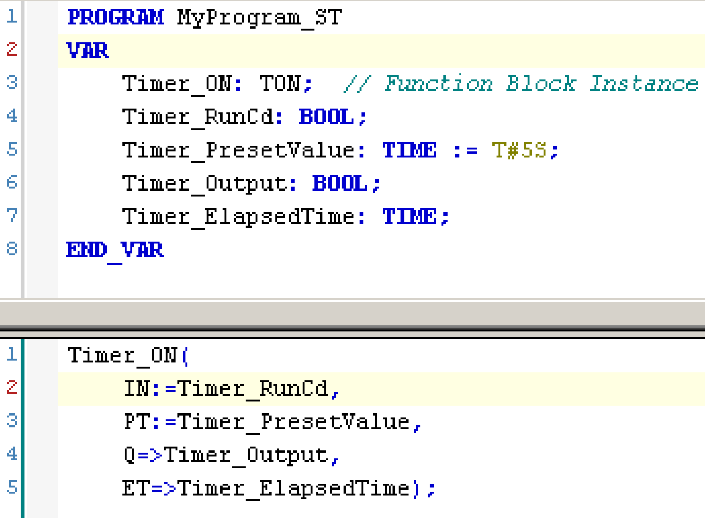

# Differences Between a Function and a Function Block

## Function

A function:

* is a POU (Program Organization Unit) that returns one immediate result.
* is directly called with its name (not through an instance).
* has no persistent state from one call to the other.
* can be used as an operand in other expressions.

**Examples:** boolean operators (`AND`), calculations, conversion (`BYTE_TO_INT`)

## Function Block

A function block:

* is a POU (Program Organization Unit) that returns one or more outputs.
* needs to be called by an instance (function block copy with dedicated name and variables).
* each instance has a persistent state (outputs and internal variables) from one call to the other from a function block or a program.

**Examples:** timers, counters

In the example, `Timer_ON` is an instance of the function block `TON`:

EIO0000003818.03