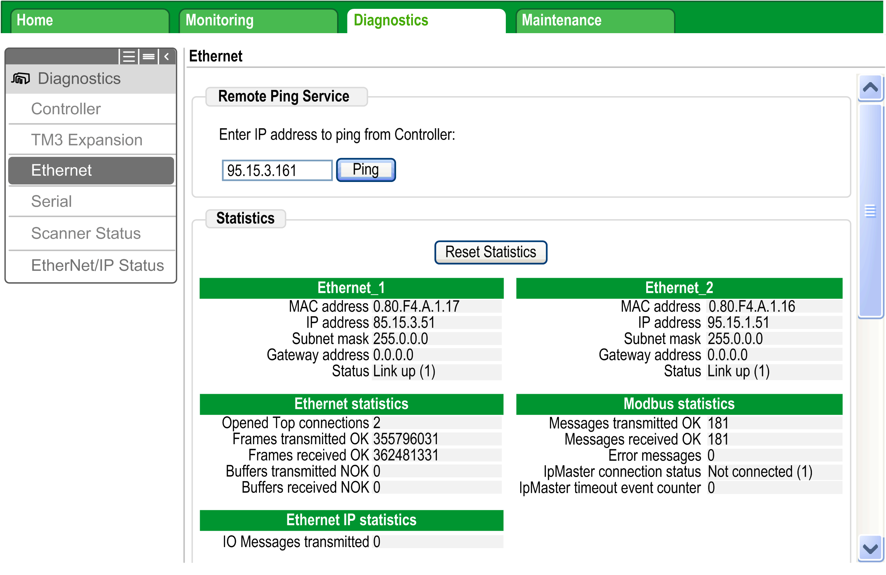
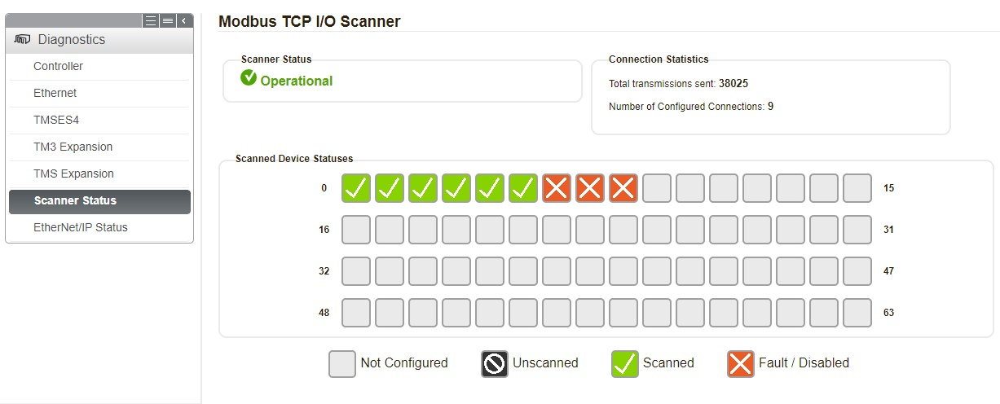

# Diagnostics: Web Server

## Overview

The Web server of the controller has a diagnostic tab.

In this tab, you can access to Industrial Ethernet diagnostic pages:

* Ethernet [diagnostic page](#D-SE-0056614__D-SE-0056614.12)
* Modbus TCP [diagnostic page](#D-SE-0056614__D-SE-0056614.13)

## Ethernet Page

Click Ethernet to display Ethernet information of the controller and to allow you to test communication with a specific IP address:

This table presents the ping test result on the Ethernet page:

| Icon | Meaning |
| --- | --- |
|  | The communication test is successful. |
|  | The controller is unable to communicate with the defined IP address. |

## Modbus TCP Status Page

Click Scanner Status to display the Modbus TCP IOScanner status (IDLE, STOPPED, OPERATIONAL) and the health bit of up to 64 Modbus TCP slave devices:

0…63 corresponds to the channel ID.

This table presents the status of each channel presented on the Scanner Status page:

| Icon | Health bit value | Meaning | Scanner status |
| --- | --- | --- | --- |
|  | 1 | Request and reply are ongoing on time. | OPERATIONAL |
|  | 0 | An error is detected, or the channel is disabled through the software. The communications are closed. | OPERATIONAL |
|  | – | This ID does not correspond to a configured channel. | OPERATIONAL or STOPPED |
|  | 0 | The scanner is stopped. The communications are closed. | STOPPED |

NOTE: Click any icon to open the device Web server (if existing). To access this Web server, the computer must be able to communicate with the device. For more information, refer to [PC routing](D-SE-0056605.html#D-SE-0056605__D-SE-0056605.4).

If the Modbus TCP IOScanner status is IDLE, no icon is displayed and the status No Scanned Devices Reported is displayed.

EIO0000003826.05