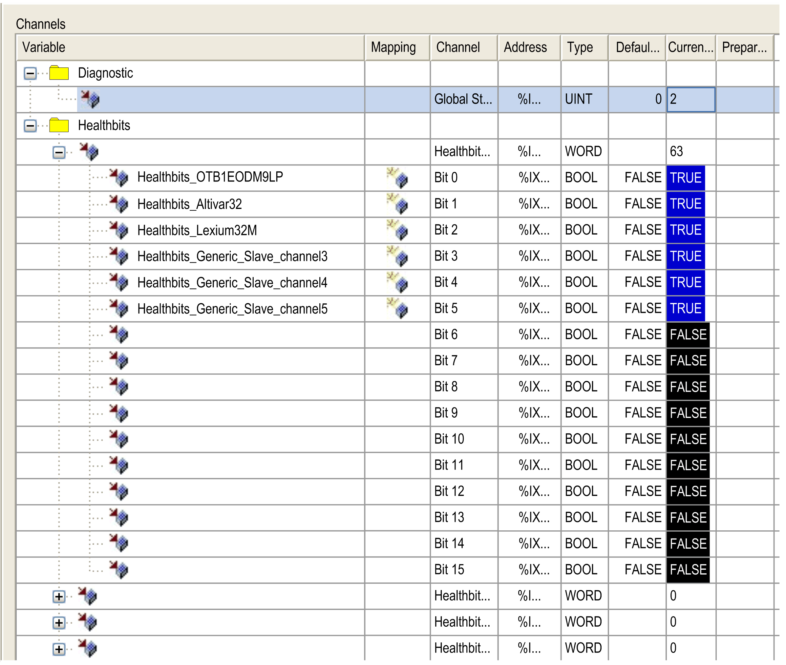
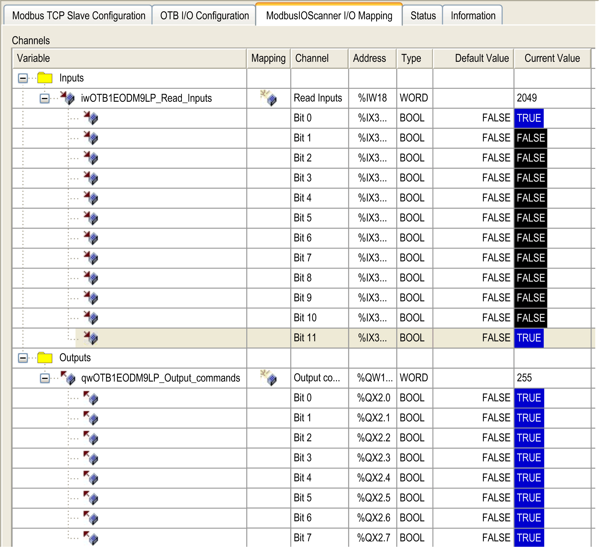

# Diagnostics: Online Mode

## Overview

In online mode, you can monitor the protocol manager in EcoStruxure Machine Expert using the following methods:

* Icons in the Devices tree
* Status tab of the protocol manager and the devices
* IOScanner I/O Mapping tab of the protocol manager for Modbus TCP IOScanner
* I/O mapping tab of the devices
* The protocol manager resources tab

## Devices Tree

The communication status of the protocol manager and the devices is presented with icons in the Devices Tree:

| Icon | Meaning |
| --- | --- |
|  | The communication with the device is normal.  NOTE: The protocol manager is always presented with this icon. |
|  | The controller is unable to communicate with the device.  NOTE: When the protocol manager is STOPPED, all devices show this icon. |

## Protocol Manager I/O Mapping

The IOScanner I/O Mapping tab of the protocol manager allows you to monitor the Modbus TCP IOScanner status and the health bit of the Modbus TCP slave devices:

| Column | | Use | Comment |
| --- | --- | --- | --- |
| Variable | Diagnostic | Assign a name to the global scanner status variable. | - |
| Healthbits | Assign a name to each health bit.  For example, name a health bit with the associated device name. | Health bits are grouped in 4 subfolders of 16 bits. |
| Address | | Retrieve the address of each variable. | Addresses may be modified when the configuration is changed. |
| Current value | | Monitor the Modbus TCP devices. | For Boolean values (health bit):   * TRUE = 1 * FALSE = 0 |

## Slave Device Mapping

Industrial Ethernet devices have an I/O Mapping tab containing their I/Os.

NOTE: Generic TCP/UDP does not have an I/O mapping tab.

This figure presents an example of an I/O Mapping tab for an Advantys OTB slave device:

| Column | | Use | Comment |
| --- | --- | --- | --- |
| Variable | Inputs | Assign a name to each input of the device. | Each bit can also be mapped. |
| Outputs | Assign a name to each output of the device. |
| Channel | | – | Symbolic name of the input or output channel of the device. |
| Address | | Retrieve the address of each variable. | Addresses may be modified when the configuration is changed. |
| Type | | – | Data type of the input or output channel. |

EIO0000003826.05