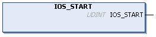

# IOS\_START: Launch the Modbus TCP IOScanner

## Function Description

This function starts the Modbus TCP IOScanner.

It allows runtime control of the Modbus TCP IOScanner execution. By default, the Modbus TCP IOScanner starts automatically when the application starts.

This function call waits for the Modbus TCP IOScanner to be physically started, so it can last up to 5 ms.

Starting a Modbus TCP IOScanner already started has no effect.

## Graphical Representation

## IL and ST Representation

To see the general representation in IL or ST language, refer to [Function and Function Block Representation](D-SE-0002384.html#D-SE-0002384).

## I/O Variable Description

This table describes the output variable:

| Output | Type | Comment |
| --- | --- | --- |
| IOS\_START | UDINT | * 0 = successful start * Other value = start unsuccessful |

## Example

This is an example of a call of this function:

rc := IOS\_START() ;

IF rc <> 0 THEN... (\* situation to be processed at application level \*)

EIO0000003826.05