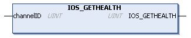

# IOS\_GETHEALTH: Read the Health Bit Value

## Function Description

This function returns the health bit value of a specific channel.

## Graphical Representation

## IL and ST Representation

To see the general representation in IL or ST language, refer to [Function and Function Block Representation](D-SE-0002384.html#D-SE-0002384).

## I/O Variable Description

This table describes the input variable:

| Input | Type | Comment |
| --- | --- | --- |
| channelID | UINT | Channel ID (refer to Modbus TCP [channels](D-SE-0057022.html#D-SE-0057022)) of the channel to monitor. |

This table describes the output variable:

| Output | Type | Comment |
| --- | --- | --- |
| IOS\_GETHEALTH | UINT | * 0: Channel I/O values are not updated  * 1: Channel I/O values are updated |

## Example

This is an example of a call of this function:

chID:=1 ;

channelHealth := IOS\_GETHEALTH(chID)(\* Get the health value (1=OK, 0=Not OK) of the channel number chID. The channel ID is displayed in the configuration editor of the device \*)

EIO0000003826.05