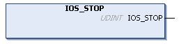

# IOS\_STOP: Stop the Modbus TCP IOScanner

## Function Description

This function stops the Modbus TCP IOScanner.

It allows runtime control of the Modbus TCP IOScanner execution. By default, the Modbus TCP IOScanner stops when the controller is `STOPPED`.

The Modbus TCP IOScanner has to be stopped, from the first cycle, until all network devices are operational.

This function call may take as long as 5 ms as it waits for the Modbus TCP IOScanner to physically stop.

Stopping an already stopped Modbus TCP IOScanner has no effect.

## Graphical Representation

## IL and ST Representation

To see the general representation in IL or ST language, refer to [Function and Function Block Representation](D-SE-0002384.html#D-SE-0002384).

## I/O Variable Description

This table describes the output variable:

| Output | Type | Comment |
| --- | --- | --- |
| IOS\_STOP | UDINT | * 0 = successful stop * Other value = stop unsuccessful |

## Example

This is an example of a call of this function:

rc := IOS\_STOP() ;

IF rc <> 0 THEN (\* Abnormal situation to be processed at application level \*)

EIO0000003826.05