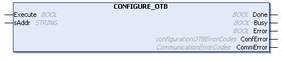

# CONFIGURE\_OTB: Send the Software Configuration of the Advantys OTB

## Function Block Description

This function block sends the software configuration data of an Advantys OTB to the physical device through Modbus TCP.

It allows the update of the configuration parameters of an I/O island without third-party software.

The Modbus TCP IOScanner must be stopped before calling this function.

The execution of this function block is asynchronous. In order to check the configuration completion, the Done, Busy, and Error output flags must be tested at each application cycle.

## Graphical Representation

## IL and ST Representation

To see the general representation in IL or ST language, refer to [Function and Function Block Representation](D-SE-0002384.html#D-SE-0002384).

## I/O Variable Description

This table describes the input variables:

| Input | Type | Comment |
| --- | --- | --- |
| Execute | BOOL | Activation entry. Start the configuration on rising edge. |
| sAddr | STRING | OTB IP address. The format of the string must be 3{xx.xx.xx.xx} |

This table describes the output variables:

| Output | Type | Comment |
| --- | --- | --- |
| Done | BOOL | Set to TRUE when the configuration completion succeeded. |
| Busy | BOOL | Set to TRUE when the configuration is in progress. |
| Error | BOOL | Set to TRUE when the configuration ended with an error detected. |
| ConfError | [configurationOTBErrorCodes](D-SE-0039155.html#D-SE-0039155) | Return values: configurationOTBErrorCodes |
| CommError | [CommunicationErrorCodes](D-SE-0039154.html#D-SE-0039154) | Return values: CommunicationErrorCodes |

## Example

This is an example of a call of this function:

`VAR`

(\*Function Block to configure OTB , need to stop the IOscanner before the execution of the FB\*)

`configure_OTB1: CONFIGURE_OTB;`

(\*init value different than 16#00000000 , IO\_start\_done=0 when we have a successful start\*)

`IO_start_done: UDINT := 1000;`

(\*init value different than 16#FFFFFFFF , IO\_start\_done=16#FFFFFFFF when we have a successful stop\*)

`IO_stop_done: UDINT := 1000;`

(\*Configure\_OTB\_done= true when we configure with success the OTB, then we can start the IO scanner\*)

`Configure_OTB_done: BOOL;`

`myBusy: BOOL;`

`myError: BOOL;`

`myConfError: configurationOTBErrorCodes;`

`myCommError: UINT;`

`myExecute: BOOL;`

`END_VAR`

(\* First, stop the IOScanner, before configuring OTB \*)

`IF NOT myExecute THEN`

`IO_stop_done:=IOS_STOP();`

`END_IF`

(\* Send the configuration data to OTB, at IP address 95.15.3.1, when myExecute is TRUE \*)

`configure_OTB1(`

`Execute:= myExecute,`

`sAddr:='3{95.15.3.1}' ,`

`Done=> Configure_OTB_done,`

`Busy=> myBusy,`

`Error=&gt; myError,`

`ConfError=&gt; myConfError,`

`CommError=&gt; myCommError);`

(\* After OTB is successfully configured, start the IOScanner \*)

`IF Configure_OTB_done THEN`

`IO_start_done:=IOS_START();`

`END_IF`

EIO0000003826.05