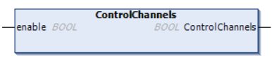

# ControlChannels: Enable or Disable all Communication Channels with TM3BCEIP

## Function Description

The ModbusTCP Remote Adapter library is only available for the TM3BCEIP bus coupler reference used with a Modbus TCP scanner. This library is added automatically when a TM3BCEIP bus coupler is added in the configuration.

This function allows you to enable or disable all communication channels with TM3BCEIP.

Channels managed by this function are reinitialized to their default value (enable) after a reset (cold/warm).

After a stop or after a start command, the channels remain disabled if they were disabled before. After a reset, the channels are enabled (default) even if they were disabled before.

NOTE: When you attempt to disable a channel communicating with a TM3BCEIP bus coupler, the system will try to re-enable the connection and send the bus coupler configuration to it. This is therefore seen as an error by the system. To effectively disable the channels connected to a TM3 bus coupler, you must disable the object that is associated to the bus coupler using the DisableRemoteAdapter property: <DeviceName>\_RemoteAdapter.DisableRemoteAdapter := TRUE;

## Graphical Representation

## IL and ST Representation

To see the general representation in IL or ST language, refer to [Function and Function Block Representation](D-SE-0002384.html#D-SE-0002384).

## I/O Variable Description

This table describes the input variable:

| Input | Type | Comment |
| --- | --- | --- |
| Enable | BOOL | Enables or disables command. |

This table describes the output variable:

| Output | Type | Comment |
| --- | --- | --- |
| ControlChannels | BOOL | Set to TRUE when all communication channels are enabled. |

## Example

This is an example of a call of this function:

<DeviceName>\_RemoteAdapter.ControlChannels(FALSE); (\* disable communication with the device \*)

EIO0000003826.05