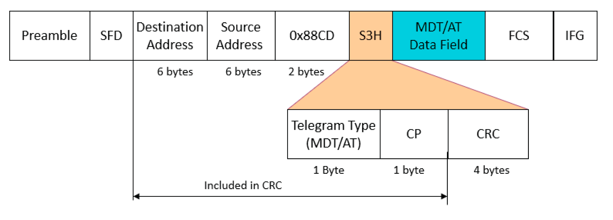

# Sercos Telegram

## Sercos Telegram and Ethernet Frame

Sercos III telegrams comply with the MAC (Media Access Control) frame format as per IEEE 802.3 and ISO/IEC 8802-3:

**SFD** Start Frame Delimiter

**FCS** Frame Check Sequence, a CRC value generated by the master and verified by the slaves for verification of integrity of the frame

**IFG** Interframe Gap, time between two frames

The destination address is the broadcast address defined for Ethernet telegrams so that the frame is transmitted to each device on the network.

The source address is the MAC address of the master.

The EtherType is a unique value assigned to Sercos (88CD hex).

Sercos divides the payload field of the Ethernet fame into the Sercos header (S3H) (6 bytes) and the Sercos data field whose maximum size is 1494 bytes. The Sercos header and the data field contain the Sercos data of the frame.

## Sercos Header

The following illustration presents the Sercos header:

The Sercos header contains the following data:

* Type of telegram (MDT or AT)
* [Sercos communication phase (CP)](D-SE-0096491.html#D-SE-0096491)
* CRC

The header of MDT0 contains the MST with the synchronization signal.

## Sercos Data Field

The following illustration presents the Sercos data field:

The Sercos data field contains the following data:

* Hot-plug field (in MDT0 and AT0 only)

  This field is used for adding new slaves to the bus in hot-plug mode (not supported by the Modicon M262 Motion Controller.
* Extended function (in MDT only)

  The field contains special synchronization information.
* Service Channel (SVC)

  The SVC is used by the master to read and write Sercos parameter (IDN) values of a slave or execute procedure commands (refer to the chapter [Sercos Parameters](D-SE-0096497.html#D-SE-0096497) for details) . Each slave has its own SVC channel assigned by the master via an offset in the telegram. SVC communication is [non-cyclic communication](D-SE-0096488.html#D-SE-0096488__D-SE-0096488.4) via the Real-Time Channel (RTC).
* Real Time Data (RTD)

  Sercos uses two types of real-time data:

  + So-called device controls

    Sercos used two types of device controls: C-DEV with control information and S-DEV with status information.
  + So-called connections

    The connections are application data such as reference/target values in the MDT and actual values in the AT. This data is transmitted by [cyclic communication](D-SE-0096488.html#D-SE-0096488__D-SE-0096488.3).

EIO0000003883.03

© 2021

Schneider Electric.

All rights reserved.