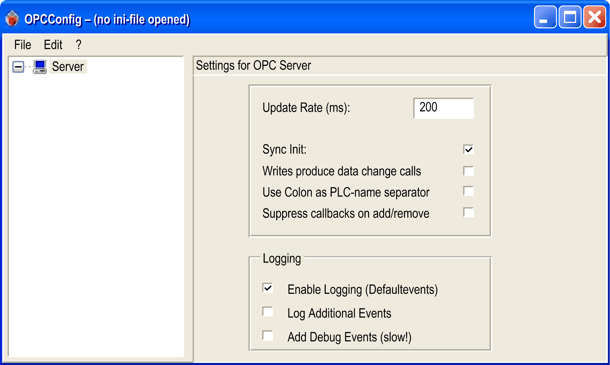

# General Information on the OPC Configuration Tool

General Information on the OPC Configuration Tool

Starting the OPC Configuration Tool

Since the OPC server is independent of EcoStruxure Machine Expert Logic Builder, use the OPC configuration tool to configure the OPC server and to share the information on the EcoStruxure Machine Expert project.

| Step | Action |
| --- | --- |
| 1 | Go to your installation directory:  ...\Tools\OPCServer |
| 2 | Double-click the OPCConfig.exe file. |

The OPC configuration tool OPCconfig.exe allows you to generate an INI file. The INI file is required to initialize the OPC server with the parameters of your choice for the communication between the OPC clients and one or more controllers.

After you have started the tool, the dialog box opens with the default settings:

The dialog box contains the following elements:

oMenu bar

oTree view for mapping the assignments of one or several controllers to the server

oConfiguration parameters that correspond to the selected node in the tree view

File Menu of the OPC Configuration Tool

The File menu provides commands for loading and saving the configuration files to / from the OPC configuration tool:

| Command | Shortcut | Description |
| --- | --- | --- |
| Open | Ctrl+O | For editing an existing configuration.  The dialog box for opening a file is displayed. Browse to an existing INI file. The filter is set to OPCconfg Files \*.ini.  The configuration described in the selected INI file is loaded to the OPC configuration tool. |
| New | Ctrl+N | For creating a new configuration.  If a configuration is open, you are requested to decide whether it is to be saved before closing.  The OPC configuration tool displays the default settings for the new configuration. |
| Save | Ctrl+S | Saves the configuration to the loaded INI file. |
| Save as | – | Saves the configuration to a new file by assigning a name that you can specify in the dialog box. |
| <n> recently opened INI-files | – | List of INI files which have been edited since the tool has been started.  You can select a file to reload it to the OPC configuration tool. |
| Exit | – | Terminates the OPC configuration tool.  If modifications to the configuration have not yet been saved, you are requested to do so. |

Edit Menu of the OPC Configuration Tool

The Edit menu provides commands for editing the configuration tree in the left part of the dialog box.

| Command | Shortcut | Description |
| --- | --- | --- |
| New Redundancygroup | Ctrl+G | A redundant group node is inserted below the Server node. If there are already controller or redundant groups listed in the tree, the new redundant group is appended at the end. By default, a new entry is named Redundant<n>, with <n> being a consecutive number starting with 1.  To rename the node, select it in the tree and execute the command Edit > Rename PLC or click it twice to make it editable. |
| Append PLC | Ctrl+A | A controller node is inserted below the Server node. A new controller is appended at the end of the tree structure. By default, a new entry is named PLC<n>, with <n> being a consecutive number starting with 1.  To rename the node, select it in the tree and execute the command Edit > Rename PLC or click it twice to make it editable. |
| Delete PLC | Ctrl+D | The selected controller entry is removed from the configuration tree. |
| Rename PLC | Ctrl+R | The selected controller entry can be renamed. |
| Reset PLC | Ctrl+Z | The settings of the selected controller are reset to the default values defined in the PLC Default Settings. |

Configuration Parameters for the Server

If a Server node is selected in the tree view of the OPC configuration tool, the following parameters are displayed in the configuration view on the right-hand side of the dialog box:

| Parameter | Default | Description |
| --- | --- | --- |
| Update rate (ms) | 200 ms  Minimum: 50 ms  Typical: 200...500 ms | Update rate of the OPC server in milliseconds.  This is the cycle time according to which the variable values are read from the controller. The data are written to the cache with which the client communicates according to a separately defined update rate.  Typically, a client also provides an update rate. This determines the interval which the client reads the values from the cache of the server. That value must be greater than or equal to the rate specified here.  The greater the interval, the less resource consumption for the OPC server and the client, but with less granularity.  NOTE: Some OPC clients automatically adapt their update rate to that of the OPC server, or display the message UNSUPPORTED\_RATE if the update rate OPC server client/server is less than the update rate server - controller.  NOTE: Together with the status information the server also provides the parameter Bandwidth usage that specifies the proportional relationship between the update rate to the configured update rate. |
| Sync init | Selected | Synchronous initialization:  The OPC server is available during start-up after the symbol configuration has been loaded. Select this option to facilitate server start. Refer to the parameter Wait time (s) in the [controller configuration view](#XREF_D_SE_0083829_12) of this dialog box. |
| Writes produce data change calls | 2 | Corresponds to the ReadCyclesAfterWrite [parameter in the OPCServer.ini file](../OPCServer.ini/OPCServer_ini-3.htm#XREF_D_SE_0064216_1). |
| Writes produce data change calls | 1 | Corresponds to the UseColonAsPlcDevider [parameter in the OPCServer.ini file](../OPCServer.ini/OPCServer_ini-3.htm#XREF_D_SE_0064216_1). |
| Suppress callbacks on add/remove | 1 | Corresponds to the GroupUpdateBehaviour [parameter in the OPCServer.ini file](../OPCServer.ini/OPCServer_ini-3.htm#XREF_D_SE_0064216_1). |
| Logging  oEnable logging (default events)  oLog Additional Events  oAdd Debug Events (slow!) | The option Enable logging (default events) is selected | Options for tracing results in a .log file.  If the option Enable logging (default events) is selected, actions and errors detected on the OPC server are written to the OPCServer.log file in the installation directory. You can select the tracing of additional (Log Additional Events) and debugging events (Add Debug Events (slow)) for error analysis.  After you have quit the OPC server, you can analyze the .log file. The messages of several OPC server sessions are written to the same .log file until the file has reached a size greater than 1 Mb. Then, the .log  file name OPCServer<date>.log is extended by the date, for example OPCServer12.10.2008.log and saved. For further tracings, a new .log file is created.  NOTE: Activating logging options has an impact on the system performance. |

Configuration Parameters for the Controller

If a controller node is selected in the tree view of the OPC configuration tool, the following parameters are displayed in the configuration view on the right-hand side of the dialog box:

| Parameter | Default | Description |
| --- | --- | --- |
| Interface | – | Select the interface that is used for communication between the OPC server and the controller.  The selection list contains the following interface types:  oARTI, ARTI3, GATEWAY, SIMULATION for CoDeSys V2.3 projects  oARTI3, GATEWAY3, and SIMULATION3 for CoDeSys V3 projects |
| Project name | – | Name of the symbol file which is to be used in case of simulation.  If no path is specified, the OPC server directory is used.  The file name corresponds to the following syntax:  oCoDeSys V3: <Project name>.<Device>.<Application>.xml  oCoDeSys V2.3: <Project name>.sdb  NOTE: This entry is only used if the SIMULATION interface or the SIMULATION3 interface is used. |
| Timeout (ms) | 10000 | If the OPC server has not received a response from the controller within this time, it is closed automatically. |
| Number of Tries | 3 | Number of attempts to transfer a data block.  As soon as the configured number of attempts have been unsuccessful, a message indicating communication interruption is generated.  (This parameter is only relevant for drivers that support communication via blocks, level 2). |
| Buffer Size (Byte) | 0 | Size of the communication buffer on the target device.  If the value is 0, the size is retrieved from the driver. If no size is retrieved, an unlimited buffer size is assumed. |
| Wait time (s) | 10 | Time (in seconds) the OPC server waits until communication to the controller is available (after an automatic start of the controller). |
| Reconnect Time (s) | 15 | Interval the OPC server waits to retry to connect to the controller via the gateway. |
| Active | Selected | If this option is selected, the controller is taken into account by the OPC server. |
| Motorola Byte Order | Not selected | Activate the Motorola byte order for controllers based on the Motorola chip set. Not used in SoMachine Motion and EcoStruxure Machine Expert based applications. Make sure that the same setting is selected in the communication setting of the controller. |
| No Login Service | Not selected | Select this option for target systems that require a login service, for example, PacDrive M. |
| Logging | Enable logging (Defaultevents) selected | Options for tracing results in a .log file.  You can select the tracing of additional (Log Additional Events) and debugging events (Add Debug Events (slow)) for error analysis.  NOTE: Activating logging options has an impact on the system performance. |

EIO0000003723.01

© 2021 Schneider Electric. All rights reserved.