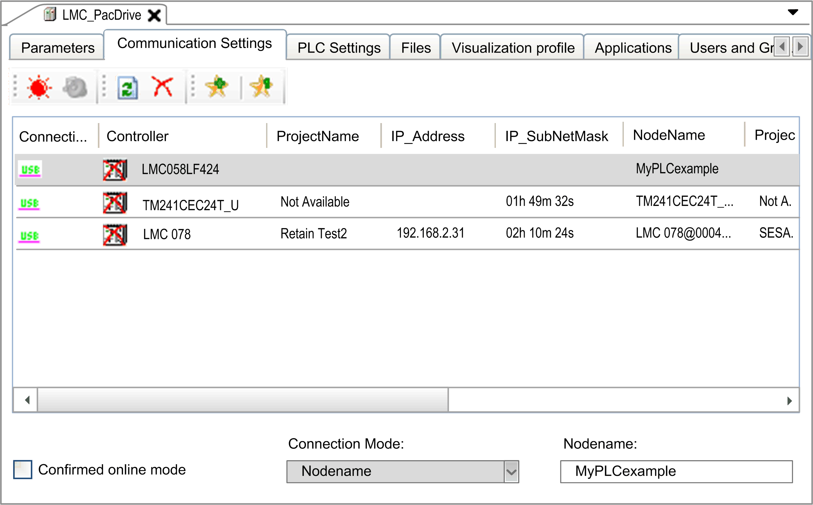

# Physical Addressing

Physical Addressing

In the Communication Settings tab in controller selection mode, you can copy the nodename of the controller selected in the list of controllers from the Nodename box:

Proceed as follows:

| Step | Action |
| --- | --- |
| 1 | Paste the nodename as new value in the PLC name or address box of the PLC address dialog box:  G-SE-0073168.1.gif-high.gif |
| 2 | Click the OK button.  Result: The following dialog box is displayed:  G-SE-0010091.2.gif-high.gif |
| 3 | From the File menu, execute the command Save As.  Result: The following dialog box is displayed:  G-SE-0010090.2.gif-high.gif |
| 4 | Enter or select, if available, the file name OPCServer.ini, and click the Save button.  NOTE: The name of the file must be OPCServer.ini. Do not use another file name.  For further information, refer to the [OPCServer.ini File chapter in the Appendix](../OPCServer.ini/OPCServer_ini-1.htm#XREF_D_SE_0092748_1). |