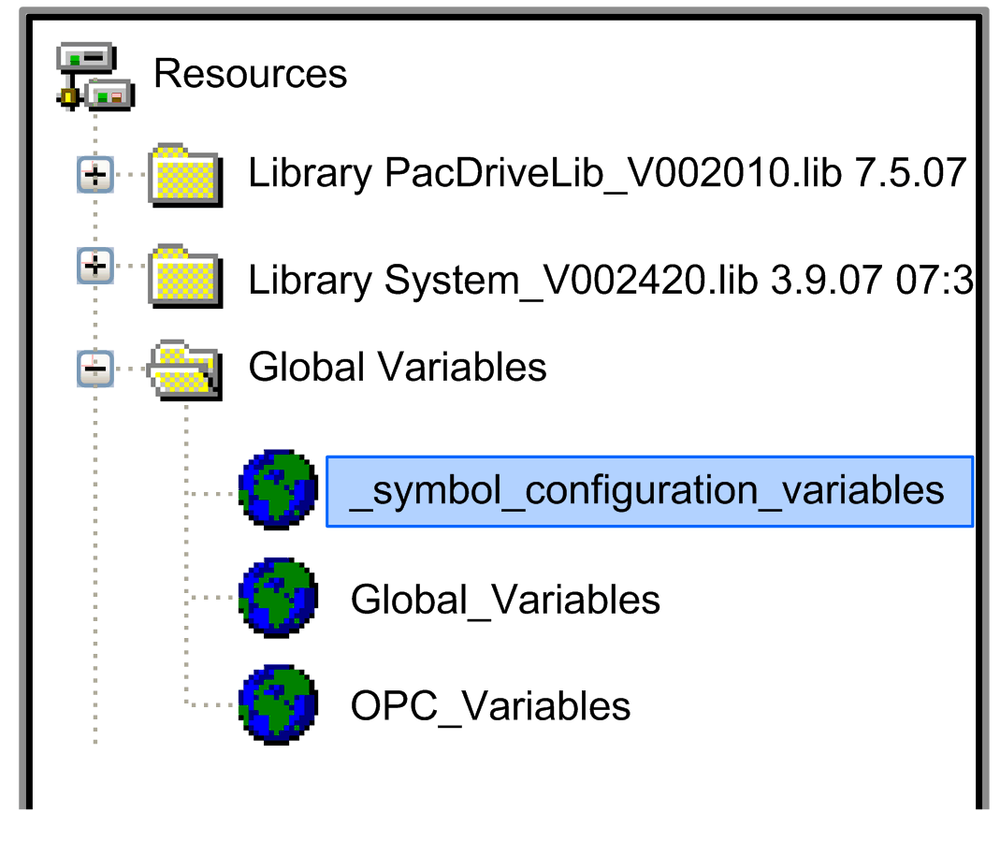

# Overview

Overview

In addition to accepting or omitting certain objects in the symbol configuration via the dialog box, you can also use another property of the symbol setting.

The parameters of the controller configuration are automatically attached to the alphabetically first global variable list.

NOTE: In EPAS-4 versions before V00.14.00, all parameters of the controller configuration are automatically attached to the alphabetically last global variable list.

If you use a list for this purpose that contains no self-defined variables, you can insert or remove the symbol configuration of all parameters of the controller configuration to/from the symbol file by executing the command Project > Options..., selecting the category Symbol configuration, and activating the option Generate symbol entries.

NOTE: In multi-controller operation, each controller has its own symbol file.