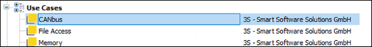

# CAN RAW

CODESYS provides the capability of sending and receiving CAN messages via the application. No devices are required in the device tree to do this. The access can also be executed parallel to the CAN stack.

**There are basically two options:**

* Access via the CANbus API: You will find an example in the [CODESYS Store](https://store.codesys.com/de/canbus-example.html) or [CODESYS Store US](https://us.store.codesys.com/canbus-example.html).

  Target group: Application programmers
* Access via the library `CAA Can Low Level Extern`

  Target group: Library developers and experts

  Hint: You can insert all required libraries for CAN L2 via the use case library `CANbus`.

9.0

© Copyright 2025, CODESYS GmbH