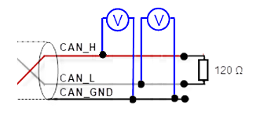
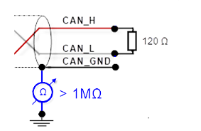
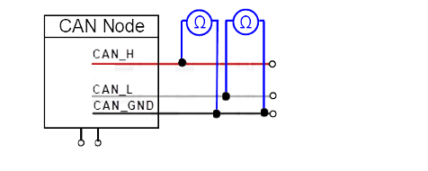

# Detecting hardware failures

**Checking the terminal resistance**

The terminal resistance is used to adapt the impedance of a node to the impedance of the used transmission cable. When there is a mismatch of the impedance, the transmitted signal is not completely absorbed by the load and part of it is reflected back into the transmission cable. If the impedances of source, transmission cable, and load are the same, then these reflections are eliminated. In this test, the serial resistance of the CAN data pair cables and the connected terminal resistors are measured.

1. Switch off the power supply of all CAN nodes.
2. **If the value is greater than 70 Ω, then make sure of the following:**

   * No open circuit exists in the wiring of the CAN\_H and CAN\_L cables.
   * The bus system has two terminal resistors, each 120 Ω – one at each end.

**Voltage of CAN\_H/CAN\_L**

Every node contains a CAN transceiver which sends difference signals. When the network communication is idle, the voltages CAN\_H and CAN\_L are approximately 2.5 V. Faulty transceivers can cause the open-circuit voltages to vary and disrupt network communication.

1. Switch off the power supply of all CAN nodes.
2. At a voltage greater than 4.0 V, you need to check for overvoltage.

**Ground**

The shielding of the CAN network may be grounded at only one location. This test indicates whether or not the shielding is grounded at multiple locations.

1. Separate the shield from the ground.
2. Connect the shield to the ground.

   * The resistance should be greater than 1 MΩ. If it is lower, then you need to search for an additional grounding of the shield.

**CAN transceiver resistance check**

CAN transceivers have a circuit which controls CAN\_H and another circuit that controls CAN\_L. Experience has shown that electrical damage to one or both circuits can increase the leakage current in these circuits.

Use a resistance measuring instrument to measure the leakage current.

1. Separate the node from the network. Leave the node without any current.
2. Measure the direct current resistance between CAN\_L and CAN\_GND.

   * Normally the resistance should be between 1 MΩ and 4 MΩ or higher. If it is lower than this range, then the CAN transceiver is probably defective.

9.0

© Copyright 2025, CODESYS GmbH