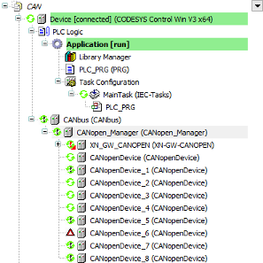

# Device tree

**In online mode, the device tree allows for an exact pinpointing of a pending diagnosis.**

* Error flag (red triangle): Hard error, such as an incorrect/missing device or connection interruption.
* Diagnosis flag (red exclamation mark): Indicates that a diagnosis entry is currently available for exactly this device.
* Error-cleared flag (gray exclamation mark): Indicates that a previously pending error has been corrected.

9.0

© Copyright 2025, CODESYS GmbH