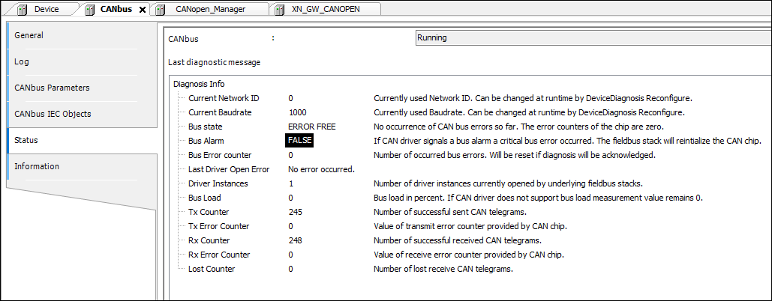

# Status Page

The status page of CAN bus displays the bus state, diagnostic messages, and the state of various parameters. On this page, you can check whether messages have been sent and received or lost. Moreover, you see whether the driver could be opened (**Driver Instances** > 0, **Last Driver Open Error**).

9.0

© Copyright 2025, CODESYS GmbH