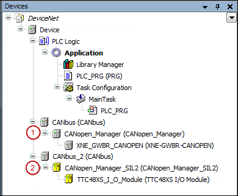

# General

The CANopen Manager is the CAN bus master and is inserted in the CAN bus configuration below the CAN bus node.

**CODESYS provides the following CANopen Masters:**

* CANopen Manager (1)
* CANopen Manager SIL2 (2)
* CANopen Manager SoftMotion: Can be inserted below a SoftMotion controller; contains adapted presets for operation of motion via CANbus.

**In CODESYS, a CANopen Remote Device is a slave device that you insert below a CANopen Manager in the device tree of a project. A distinction is made between modular and non-modular slaves:**

* **Modular slaves**: You can insert CANopen modules (submodules) below a modular slave. These modules provide a **I/O Mapping** tab to "map" their inputs and outputs. Modular slaves can also have fixed I/Os. Then these devices also provide the **I/O Mapping** tab. Modular devices provide the **Configure PDO mapping automatically** option, which we recommend for standard applications. You find this option in the **CANopen Remote Device** dialog, on the **General** tab.
* **Non-modular slaves**: You cannot insert additional modules below a non-modular device. The inputs and outputs of these devices are "mapped" in the **I/O Mapping** dialog. Automatic mapping is not possible here.

9.0

© Copyright 2025, CODESYS GmbH