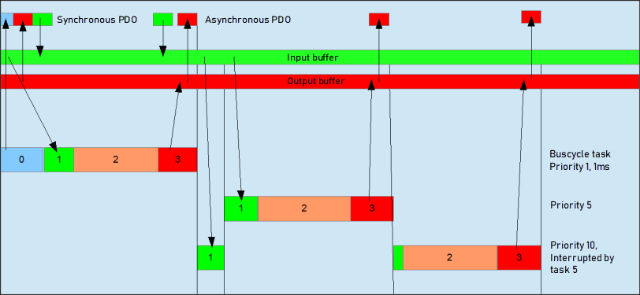

# Behavior of the bus cycle for CANopenManager

0: Sending/receiving of synchronous PDOs

1: Receiving of asynchronous PDOs

2: IEC task

3: Writing the outputs in the output buffer

For more information, see: [task configuration](../../../../../../api/crossBook?lang=en-US&virtualBookName=../&topicID=)

9.0

© Copyright 2025, CODESYS GmbH